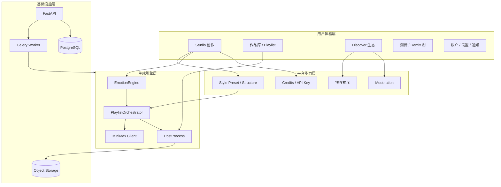
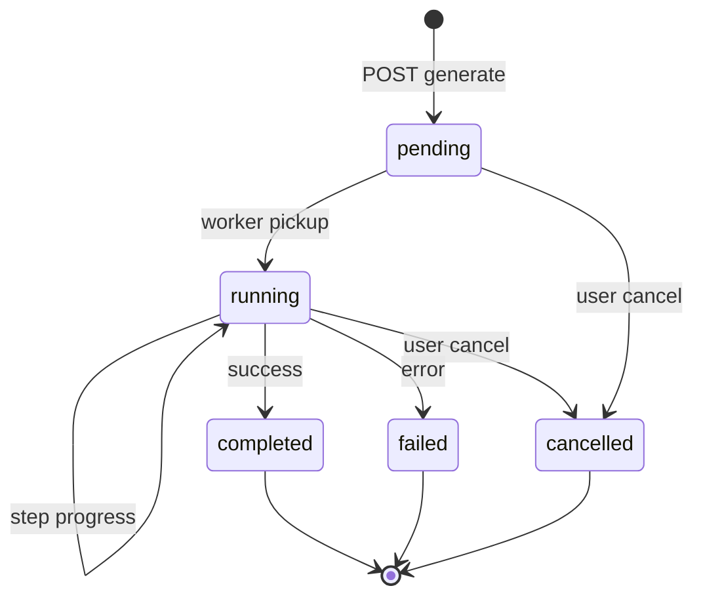
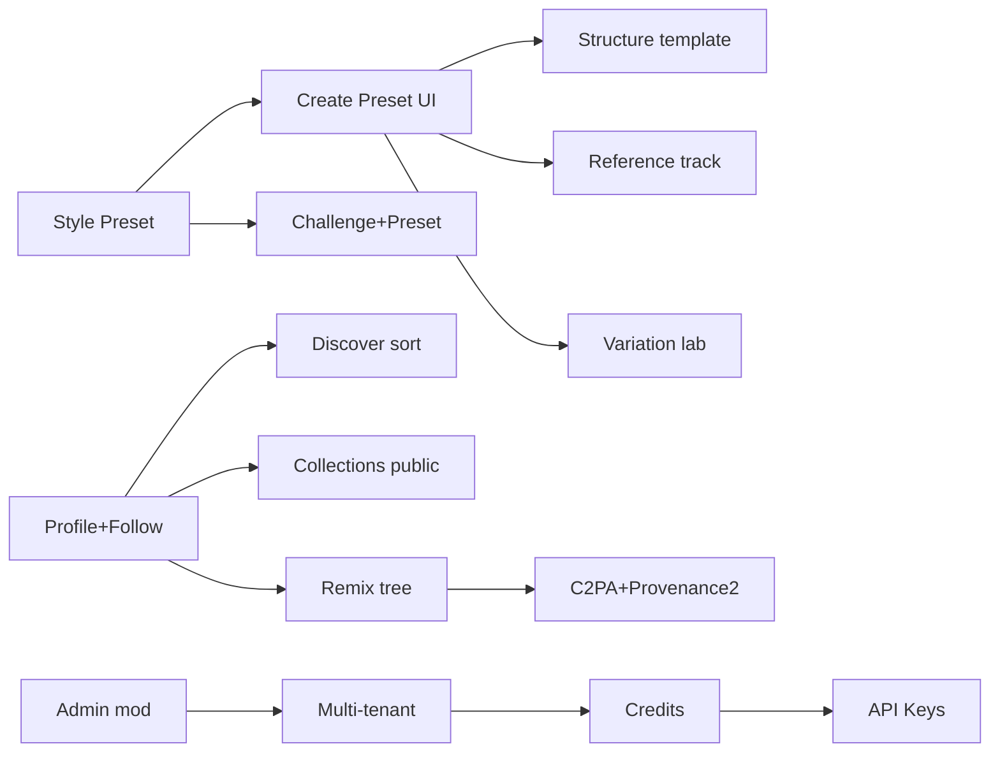

# Vibe Sorcery 实施蓝图（Implementation Blueprint）

> **规划文档三部曲**  
> 1. [PRODUCT_ROADMAP_v5.md](PRODUCT_ROADMAP_v5.md) — 战略、分层、甘特  
> 2. [PRODUCT_SPEC_COMPLETE.md](PRODUCT_SPEC_COMPLETE.md) — 功能矩阵、模块规格、验收  
> 3. **本文** — 权限/状态机/埋点/导航/依赖/迁移/全量清单（可直接拆 ticket）

---

## 1. 系统全景（一张图）



**价值闭环**：`Preset 降低门槛 → Studio 生成 → Works 管理 → Discover 传播 → Remix 衍生 → Provenance 信任 → Follow/挑战 留存 → Credits/API 变现`

---

## 2. 权限与访问控制矩阵

### 2.1 角色

| 角色 | 定义 |
|------|------|
| `guest` | 未登录 |
| `user` | 普通注册用户 |
| `admin` | `is_admin=true` |
| `tenant_admin` | 租户内管理员（P2） |
| `api_client` | API Key 持有者（P2） |

### 2.2 资源 × 操作

| 资源 | guest | user (owner) | user (other) | admin |
|------|-------|--------------|--------------|-------|
| 公开 Post/Work | 读 | 读 | 读 | 读+删 |
| 私有 Work | — | CRUD | — | 读+删 |
| 生成 job | — | 创建/读/cancel | — | 读 |
| seed_work_id 复用 | — | 自己的 + 公开 | 仅公开 | 全部 |
| Remix 公开 Work | — | 创建（需许可 P2） | 创建 | 创建 |
| Comment/Like | — | 创建 | 创建 | 删 |
| Follow | — | 创建/取消 | — | — |
| Collection | — | CRUD 自己的 | 读公开合集 | 读 |
| Provenance export | 读公开 | 读自己的 | 读公开 | 读 |
| Admin 面板 | — | — | — | 全部 |
| Style Preset 编辑 | 读 | 读 | 读 | CRUD |
| API Key | — | — | — | 自管（P2） |

### 2.3 实现检查点

- [ ] 所有 `GET /works/{id}` 走 visibility + owner 校验
- [ ] `can_use_work_as_seed()` 覆盖 remix/cover/reference
- [ ] Remix API 校验 `allow_remix`（P2 字段落地后）
- [ ] Admin 路由统一 `require_admin`
- [ ] 多租户：查询默认 `WHERE tenant_id = :jwt.tenant`（P2）

---

## 3. 异步任务状态机

### 3.1 GenerationJob



| 状态 | progress | UI | 可转移 |
|------|----------|-----|--------|
| `pending` | 0 | 排队中 | running, cancelled |
| `running` | 0–1 | 进度条+step 试听 | completed, failed, cancelled |
| `completed` | 1 | 完成 CTA | — |
| `failed` | — | 错误+重试 | — |
| `cancelled` | — | 已取消 | — |

**Worker 协作式 cancel**：orchestrator 每 step 前 `_is_cancelled()`；single task 同理。

### 3.2 PostProcess（Work 级，非 job）

| 阶段 | 字段 | UI badge |
|------|------|----------|
| `queued` | post_process_status.queued | 处理中… |
| `hls_done` | hls_url 有值 | HLS ✓ |
| `cover_done` | cover_url 有值 | Cover ✓ |
| `c2pa_done` | provenance.c2pa_manifest | Verified ✓ |
| `failed` | last_error | 重试按钮 |

---

## 4. Feature Flag 全量目录

| Key | 默认 | 影响范围 | 目标 gate |
|-----|------|----------|-----------|
| `hls_streaming` | ON | post_process HLS | ✅ 已有 |
| `music_cover` | ON | `/studio/music-cover` | 生成路径 P1 |
| `c2pa_provenance` | 配置 | C2PA 步骤 | ✅ 已有 |
| `personalized_feed` | ON | feed sort=personalized | ✅ 已有 |
| `style_presets` | OFF→ON | Preset API + UI | P0 新增 |
| `variation_lab` | OFF | variations API | P1 新增 |
| `reference_track` | OFF | journey.reference | P1 新增 |
| `remix_tree` | OFF | remix-tree API | P1 新增 |
| `notifications` | OFF | 通知中心 | P2 新增 |
| `api_keys` | OFF | Open API | P2 新增 |
| `credits_gate` | OFF | 生成前扣费 | P2 新增 |
| `multi_tenant` | OFF | tenant 过滤 | P2 新增 |

**规则**：新功能先 flag OFF → 内测 → Admin 打开 → 默认 ON 写进 seed。

---

## 5. 埋点与分析事件目录

### 5.1 核心漏斗

| 事件 | 属性 | 用途 |
|------|------|------|
| `auth_register` | source | 注册转化 |
| `auth_login` | — | 回访 |
| `studio_open` | mode | 创作入口 |
| `preset_select` | preset_id | 风格包使用率 |
| `emotion_analyze` | success, duration_ms | 分析稳定性 |
| `generate_start` | type, steps, has_waypoints | 生成意图 |
| `generate_complete` | job_id, duration_s, step_count | 成功率/耗时 |
| `generate_fail` | error_code | 失败归因 |
| `generate_cancel` | step | 取消分布 |
| `work_publish` | work_id, allow_remix | 发布转化 |
| `post_like` / `post_comment` | post_id | 互动 |
| `remix_start` | source_work_id | 生态 |
| `follow` | target_username | 社交 |
| `challenge_enter` | slug | 活动 |
| `provenance_view` | work_id | 信任 |
| `provenance_export` | format | 导出 |

### 5.2 实现建议（P1）

- 前端：`track(event, props)` → `POST /analytics/events` 或 Plausible/PostHog
- 后端：生成 job 写 structured log 即可；Admin 仪表盘读聚合

---

## 6. 信息架构与导航（目标态）

### 6.1 Web 主导航（SiteNav 目标）

```
Create     → Studio | Emotion map
Library    → Works | Playlists | Collections   ← 新增 Collections
Social     → Discover | Challenges
Account    → Settings | Notifications | Admin
```

顶栏右侧：`AuthStatus` + **通知铃铛**（P2）+ 头像菜单 → 我的主页 `/u/me`

### 6.2 页面级 UX 要点

| 页面 | 必含区块 | 空状态 | 错误状态 |
|------|----------|--------|----------|
| `/create` | Preset 条、Mode、Seed、Params、生成 | 引导上传 seed | job failed 重试 |
| `/works` | 列表、Cover/Remix/发布 | 跳转 Studio | 401 Banner |
| `/collections` | 网格+播放 | 去发现 | — |
| `/community` | sort、卡片、评论 | 暂无公开 | 加载失败 toast |
| `/u/[user]` | 头图、Follow、Tabs | 暂无公开作品 | 404 用户 |
| `/challenges/[slug]` | 规则、Preset、排行榜、参赛 | — | — |
| `/provenance/[id]` | 谱系、verify、Remix 树 Tab | — | — |
| `/settings` | 偏好 Tag | — | — |
| `/settings/profile` | bio、avatar | — | — |
| `/packageOps/pages/admin/index` | stats、usage、flags、presets、reports | — | 403 Empty |

### 6.3 设计系统（延续 v2 zinc + teal）

- 组件库：`Button/Card/Tag/FormField/WorkRow/AudioPlayer` 已统一
- Studio 专用：`PresetCarousel`（P0 新增）、`RemixTreeGraph`（P1）
- 动效：GenerationProgress bar only；避免 purple gradient

---

## 7. 组件与 API 注册表（待建项）

| 组件 | 路径 | 依赖 API | Phase |
|------|------|----------|-------|
| PresetCarousel | `studio/PresetCarousel` | GET presets, apply-preset | 5 |
| ProfileHeader | `profile/ProfileHeader` | GET user profile | 5 |
| FollowButton | `social/FollowButton` | POST follow | 5 |
| CollectionsGrid | `collections/CollectionsGrid` | GET collections | 5 |
| FeedSortBar | `community/FeedSortBar` | feed?sort= | 5 |
| RemixTreeGraph | `provenance/RemixTreeGraph` | remix-tree | 6 |
| VariationGrid | `studio/VariationGrid` | generate/variations | 6 |
| ReferenceTrackPanel | `studio/ReferenceTrackPanel` | analyze + reference | 6 |
| ChallengeEnterPanel | `challenges/EnterPanel` | enter | 6 |
| PostProcessBadges | `ui/PostProcessBadges` | work fields | 7 |
| NotificationBell | `layout/NotificationBell` | notifications | 8 |
| CreditsBanner | `studio/CreditsBanner` | me/credits | 8 |

---

## 8. 模块依赖图（实施顺序约束）



**不可并行乱序**：Variation Lab 依赖 Preset 配置结构；Open API 依赖 Credits；Remix 树依赖 parent_work_id 数据质量。

---

## 9. 数据迁移与 Rollout

### 9.1 Alembic 迁移顺序（建议）

1. `style_presets` 表 + seed 5 条官方 preset  
2. `collections.title`, `collections.visibility`  
3. `works.preset_id`, `works.reference_work_id`, `works.post_process_status`  
4. `works.allow_remix`, `works.license`  
5. `notifications` 表  
6. `user_credits`, `api_keys`  
7. backfill `tenant_id='default'` 全表  

### 9.2 发布策略

| 阶段 | 受众 | Flags |
|------|------|-------|
| Alpha | 管理员 | 全部 OFF，手动开 |
| Beta | 10% 用户 | style_presets ON |
| GA | 100% | 默认 ON + 文档更新 |

### 9.3 回滚

- Flag OFF 即隐藏 UI；新 API 返回 404 when flag off  
- DB 迁移只增字段不删；rollback 用 feature 不用 drop column  

---

## 10. 商业化与额度模型（P2 详设）

### 10.1 计量单位

| 操作 | 消耗 credits |
|------|----------------|
| Single 生成 | 1 |
| Playlist 每 step | 1 |
| Remix / Cover | 1 |
| Lyrics 生成 | 0.2（向上取整） |
| Variation ×N | N × single |
| M3 plan_journey | 0.1 |

### 10.2 套餐（示例）

| Tier | 月 credits | 价格 |
|------|------------|------|
| Free | 10 | $0 |
| Creator | 100 | $9 |
| Pro | 500 | $29 |
| Team | 2000 | $99 |

### 10.3 Gate 流程

```
POST /works/generate/* 
  → estimate_credits(config)
  → if balance < estimate: 402 Payment Required
  → enqueue job
  → on completed: deduct; on failed: refund
```

---

## 11. Mobile / 小程序分阶段能力包

### 11.1 Expo Phase A（4 周）

- Feed + like + comment 读
- Follow + 作者跳转（WebView 或 in-app profile 简版）
- Create：Preset + 6-step playlist + seed 上传
- HLS AudioPlayer
- Job poll（WS 可选）

### 11.2 Expo Phase B

- Remix + provenance 简版
- Challenge 列表 + enter
- Push notification

### 11.3 Taro 小程序 Phase B

- Feed 列表 + 原生 audio（短音频）
- 单曲 text_intent 生成（已有壳）
- 登录 + 分享卡片

**限制声明**：小程序不支持完整文件上传 journey → 仅 single + seed_work_id 选库。

---

## 12. 国际化与无障碍（P2）

| 项 | 范围 |
|----|------|
| i18n | zh-CN 默认 + en-US；Studio 术语表统一 |
| a11y | AudioPlayer keyboard、FormField aria、对比度 WCAG AA |
| 歌词 | lyrics_language: zh/en/ja/ko |

---

## 13. 全量功能清单（可拆 GitHub Issues）

格式：`[域]-[编号] 标题 | Phase | 优先级`

### 13.0 Intent-First（P0 最高优先）

| ID | 功能 | Ph | P |
|----|------|----|---|
| IF-01 | prompt_journey orchestrator | 5A | P0 |
| IF-02 | API 去 seed 必填 + text_intent | 5A | P0 |
| IF-03 | infer_from_intent 无音频 moods | 5A | P0 |
| IF-04 | Studio 重组 Preset+intent 主栏 | 5A | P0 |
| IF-05 | 首页 seedless 文案 | 5A | P0 |
| IF-06 | Quick Track 默认 Tab | 5A | P0 |
| IF-07 | AudioAnchorPanel 替代首屏 Seed | 5A | P0 |

### 13.1 账户 ACC（12 项）

| ID | 功能 | Ph | P |
|----|------|----|---|
| ACC-01 | 公开主页 API + UI | 5 | P0 |
| ACC-02 | Follow 按钮 Discover/主页 | 5 | P0 |
| ACC-03 | Profile 编辑页 bio/display_name | 5 | P0 |
| ACC-04 | Avatar presign 上传 | 5 | P1 |
| ACC-05 | 粉丝/关注列表页 | 6 | P1 |
| ACC-06 | 用户搜索 | 7 | P2 |
| ACC-07 | 账号删除 GDPR | 8 | P2 |
| ACC-08 | 邮箱验证 | 8 | P2 |
| ACC-09 | OAuth GitHub/Google | 9 | P3 |
| ACC-10 | tenant 注册邀请码 | 8 | P2 |
| ACC-11 | tenant_admin 角色 | 8 | P2 |
| ACC-12 | 封禁用户 Admin | 7 | P1 |

### 13.2 Studio STU（18 项）

| ID | 功能 | Ph | P |
|----|------|----|---|
| STU-01 | style_presets 表+seed | 5 | P0 |
| STU-02 | GET /config/presets | 5 | P0 |
| STU-03 | POST /studio/apply-preset | 5 | P0 |
| STU-04 | PresetCarousel UI | 5 | P0 |
| STU-05 | Studio 草稿 localStorage | 5 | P1 |
| STU-06 | structure_template.py | 6 | P1 |
| STU-07 | Structure 选择 UI | 6 | P1 |
| STU-08 | reference journey 字段 | 6 | P1 |
| STU-09 | ReferenceTrackPanel | 6 | P1 |
| STU-10 | generate/variations API | 6 | P1 |
| STU-11 | VariationGrid UI | 6 | P1 |
| STU-12 | 人声 hint prompt 层 | 7 | P2 |
| STU-13 | lyrics 多语言贯通 | 6 | P1 |
| STU-14 | StudioDraft 服务端草稿 | 8 | P2 |
| STU-15 | WAV 导出转码 | 7 | P2 |
| STU-16 | 波形可视化 | 7 | P2 |
| STU-17 | batch delete works | 6 | P1 |
| STU-18 | playlist 公开+编辑标题 | 6 | P1 |

### 13.3 库 LIB（8 项）

| ID | 功能 | Ph | P |
|----|------|----|---|
| LIB-01 | /collections 页面 | 5 | P0 |
| LIB-02 | Collection visibility | 5 | P0 |
| LIB-03 | post_process badges | 7 | P1 |
| LIB-04 | MP3 下载按钮 | 6 | P1 |
| LIB-05 | work unlisted 链接 | 7 | P2 |
| LIB-06 | playlist 公开分享页 | 6 | P1 |
| LIB-07 | works 筛选排序 | 6 | P1 |
| LIB-08 | play_count 统计 | 7 | P2 |

### 13.4 社区 SOC（14 项）

| ID | 功能 | Ph | P |
|----|------|----|---|
| SOC-01 | Feed sort UI | 5 | P0 |
| SOC-02 | feed?tag= API+UI | 6 | P1 |
| SOC-03 | GET /search | 7 | P2 |
| SOC-04 | `/packageOps/pages/embed/index?workId=` | 7 | ✅ |
| SOC-05 | 发布选 Remix 许可 | 7 | P2 |
| SOC-06 | @mention 评论 | 8 | P2 |
| SOC-07 | 分享 Open Graph meta | 6 | P1 |
| SOC-08 | Discover → Studio 深链 | 5 | P0 |
| SOC-09 | remix-tree API | 6 | P1 |
| SOC-10 | RemixTree UI | 6 | P1 |
| SOC-11 | 举报理由分类 | 7 | P2 |
| SOC-12 | 敏感词 filter | 7 | P1 |
| SOC-13 | rate limit middleware | 7 | P1 |
| SOC-14 | 官方话题运营位 | 8 | P2 |

### 13.5 挑战 CHL（6 项）

| ID | 功能 | Ph | P |
|----|------|----|---|
| CHL-01 | /challenges/[slug] 详情 | 6 | P1 |
| CHL-02 | 页内参赛 UI | 6 | P1 |
| CHL-03 | Admin 创建挑战 UI | 6 | P1 |
| CHL-04 | 绑定 preset_id | 6 | P1 |
| CHL-05 | 排行榜算法 | 6 | P1 |
| CHL-06 | 挑战截止 cron | 8 | P2 |

### 13.6 溯源 TRU（7 项）

| ID | 功能 | Ph | P |
|----|------|----|---|
| TRU-01 | provenance 展示 preset/reference | 6 | P1 |
| TRU-02 | C2PA 二进制嵌入 | 7 | P1 |
| TRU-03 | verify 解析二进制 | 7 | P1 |
| TRU-04 | PDF 导出 | 8 | P2 |
| TRU-05 | 真实 blockchain RPC | 8 | P2 |
| TRU-06 | license_snapshot remix | 7 | P2 |
| TRU-07 | .vibe schema v2 | 7 | P1 |

### 13.7 平台 PLT（10 项）

| ID | 功能 | Ph | P |
|----|------|----|---|
| PLT-01 | tenant query 中间件 | 8 | P2 |
| PLT-02 | user_credits 表+gate | 8 | P2 |
| PLT-03 | Stripe webhook | 8 | P2 |
| PLT-04 | api_keys CRUD | 8 | P2 |
| PLT-05 | webhooks job.completed | 8 | P2 |
| PLT-06 | notifications 全栈 | 8 | P2 |
| PLT-07 | admin_audit_log | 7 | P1 |
| PLT-08 | Prometheus /metrics | 7 | P1 |
| PLT-09 | Playwright E2E CI | 7 | P1 |
| PLT-10 | 存储 lifecycle cron | 8 | P2 |

### 13.8 客户端 CLI（6 项）

| ID | 功能 | Ph | P |
|----|------|----|---|
| CLI-01 | packages/api-client 扩展 | 5 | P0 |
| CLI-02 | Expo Phase A | 7 | P1 |
| CLI-03 | Expo Phase B | 8 | P2 |
| CLI-04 | Taro Phase B | 8 | P2 |
| CLI-05 | 通知 Web Push | 8 | P2 |
| CLI-06 | 离线缓存 feed | 9 | P3 |

**合计：81 项可拆 ticket**（不含 v4 已完成项）

---

## 14. 测试用例映射（抽样）

| Ticket | 测试 |
|--------|------|
| STU-03 apply-preset | unit: waypoint 缩放 6 steps |
| STU-10 variations | integration: 3 works same parent config |
| ACC-01 profile | e2e: 公开页 200 无 token |
| PLT-02 credits | unit: 402 when balance 0 |
| TRU-02 c2pa | integration: verify embedded manifest |
| SOC-09 remix-tree | unit: 3-level parent chain |

---

## 15. 风险登记册

| ID | 风险 | 影响 | 缓解 |
|----|------|------|------|
| R1 | MiniMax 配额耗尽 | 生成全失败 | credits + 队列限流 + mock 降级 |
| R2 | Essentia 模型缺失 | 分析不准 | fallback tags + 文档 |
| R3 | Playlist 超时 | 差 UX | step 试听 + partial result |
| R4 | C2PA 嵌入失败 | 信任受损 | fallback sidecar + flag |
| R5 | 小程序审核 | 上线延迟 | 功能子集声明 |
| R6 | Remix 版权争议 | 法律 | allow_remix + 举报 + ToS |

---

## 16. 文档维护规则

1. 新功能先更新 **SPEC §1 矩阵** → **Blueprint §13 清单** → 再写代码  
2. 完成 ticket 将 ⬜ 改 ✅ 并注明 PR  
3. MINIMAX_MODELS.md 随 API 字段变更同步  
4. Phase 结束打 tag `v5-phase-N`  

---

## 17. 推荐阅读顺序

1. 产品经理 / 你：**ROADMAP §1–2** → **SPEC §0–2 旅程** → **Blueprint §13 清单**  
2. 后端：**SPEC §3–5–8–9** → **Blueprint §2–3–9**  
3. 前端：**SPEC §10** → **Blueprint §6–7**  
4. 运维：**PHASE3** + **Blueprint §9–15**  

---

**若开始编码**：从 **Phase 5** 的 `ACC-01`、`STU-01~04`、`LIB-01`、`SOC-01` 共 7 个 ticket 起步，1–2 周可交付可感知 MVP 增量。
