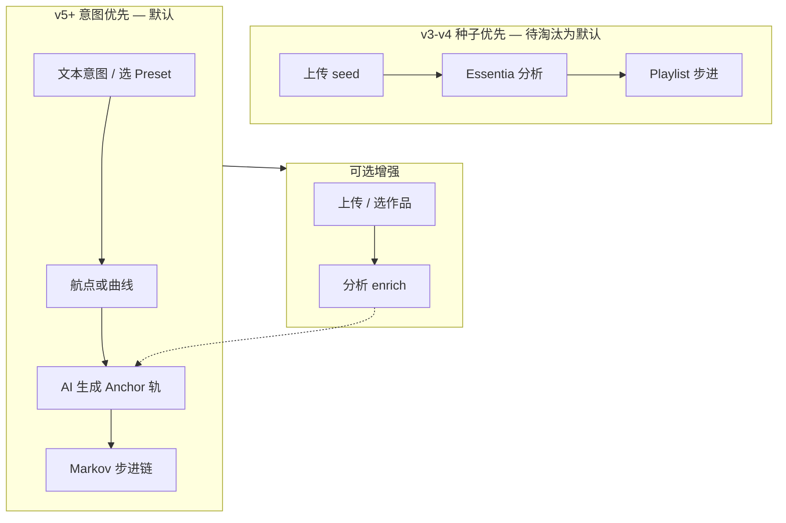

# Vibe Sorcery 意图优先架构（Intent-First）

> **战略转向**：种子音频从「核心流程必经」降级为「可选增强」。  
> 默认路径 = **说想要什么 → 选风格 → 一键生成**；上传/选库内作品仅在有明确需求时出现。  
> 配套：[PRODUCT_UX_DESIGN_SYSTEM.md](PRODUCT_UX_DESIGN_SYSTEM.md) · [PRODUCT_SPEC_COMPLETE.md](PRODUCT_SPEC_COMPLETE.md)

---

## 1. 为什么要改

### 1.1 现状问题

| 现象 | 用户感受 | 代码事实 |
|------|----------|----------|
| Playlist 必须上传 seed | 「我还没歌怎么玩？」 | `works.py` 400 without file/seed_work_id |
| Create 首屏 SeedPicker | 像 DAW 导入工程 | UI 把 seed 放在主表单顶部 |
| Journey 页强调上传 | 与 Emotion map 心智冲突 | 航点可手画，却仍要音频 |
| 新手 onboarding 卡在文件 | 注册 → 流失 | 移动/小程序上传更麻烦 |

### 1.2 论文 vs 产品

研究 pipeline（Vibe Sorcery 论文）以 **Listener 分析种子** 启动 Markov 链 —— 适合 CLI 实验。  
**平台 2.0+** 面向大众：MiniMax music-2.6 已支持 **纯 prompt 生成**（Single 路径已证明）。Playlist 应改为 **「意图 + AV 航点驱动」**，种子仅作 optional anchor。

### 1.3 新北极星句

**「描述情绪与风格，几秒开始听；有歌想延续再附上。」**

---

## 2. 三代流程对比



| 维度 | 旧默认 | 新默认 |
|------|--------|--------|
| 第一步 | 找音频文件 | 选 Preset 或写一句话 |
| 情绪来源 | 分析 seed | Preset + waypoints + 可选分析 |
| Playlist step 0 | 用户 seed 入库 | **Synthetic Anchor**（AI 生成） |
| 上传 | 必填 | Advanced「用音频锚定」 |
| 核心指标 | 分析成功率 | **TTFV（首次听到）** |

---

## 3. 五种创作入口（按门槛排序）

用户只看到前 3 个；后 2 个在 Advanced。

| # | 名称 | 输入 | 输出 | 需要 seed | 默认展示 |
|---|------|------|------|-----------|----------|
| **E1** | **Quick Track** | 一句话 + Preset | 单曲 | 否 | ✅ 首页 CTA |
| **E2** | **Quick Journey** | Preset + 步数 + 曲线 | Playlist | 否 | ✅ Studio 默认 Tab |
| **E3** | **Text Journey** | 长文本 → LLM 规划 | Playlist | 否 | ✅ Studio Tab |
| E4 | Vocals | 歌词主题 | 人声曲 | 否 | Studio Tab |
| E5 | **Audio Anchor** | 上传/选作品 | 分析 enrich 或 Markov 真 seed | **可选** | Advanced 折叠 |

**Remix / Cover** 不属于「创作起点」，从 Discover/Works 进入 —— 天然有源作品，不要求用户自备 seed 文件。

---

## 4. 后端：Synthetic Anchor Playlist

### 4.1 概念

**Synthetic Anchor（合成锚点轨）**：无用户 seed 时，orchestrator 用 `text_intent + preset moods/genres + step0 target_av` 调用 music-2.6 生成第 0 轨，作为 Markov 链起点；provenance `record_type: "anchor"`（非 `"seed"`）。

### 4.2 `playlist_orchestrator.py` 改造要点

```
generate_playlist(job, journey, music_params, seed_audio_bytes: bytes | None = None, anchor_context: dict | None = None)

if seed_audio_bytes:
  # 现有路径：分析 → seed Work → 链式生成
else:
  # 新路径：
  moods/genres ← anchor_context (preset + text_intent)
  target_av ← target_av_for_step(0, steps, waypoints, curve)
  prompt ← build_music_prompt(..., text_intent=..., target_av=...)
  anchor_bytes ← generate_music(prompt)
  创建 anchor Work (record_type anchor)
  current_input ← anchor_bytes
  for step in 1..steps:  # 现有 loop
```

**步数语义调整（UX 文案）**：

- 用户选「6 首旅程」= **6 首 AI 生成曲**（不含 anchor 时 6 首全生成；或 anchor + 5 步 —— 产品二选一，建议 **6 首全为生成**，无 hidden anchor 轨，见 §4.4）

### 4.3 推荐：Pure Prompt Journey（更简）

**不保留 Markov 音频链作为默认**；每步独立用 `target_av(step)` + 共享 `text_intent` 生成，仅用 **上一曲 embedding 或 moods 漂移** 做 soft continuity（可选）。

| 模式 | config.journey.mode | 行为 | 门槛 |
|------|---------------------|------|------|
| `prompt_journey` | **默认** | 每步 prompt+AV，无音频输入 | 最低 |
| `markov` | Advanced | 上一步 audio → analyze → 下一步 | 需 anchor（可 synthetic） |
| `audio_anchor` | Advanced | 用户 seed 分析 + markov | 有上传时 |

**默认 `prompt_journey`** 彻底摆脱 seed；`markov` 留给「用 MY 歌延续」 power user。

### 4.4 API Schema 变更

```python
class PlaylistGenerateRequest(BaseModel):
    text_intent: str | None = None      # 新增，默认 journey 描述
    preset_id: str | None = None        # 新增
    journey: JourneyConfig
    music_params: MusicParams
    seed_work_id: str | None = None     # 可选
    # file upload 可选
    generation_mode: Literal["prompt_journey", "markov", "audio_anchor"] = "prompt_journey"
```

**路由校验修改**：

```diff
- if not seed_storage_key and not resolved_seed_work_id:
-     raise HTTPException(400, "Provide seed audio file or seed_work_id")
+ if generation_mode == "audio_anchor" and not seed:
+     raise HTTPException(400, "audio_anchor mode requires seed")
+ if not text_intent and not preset_id and not seed:
+     raise HTTPException(400, "Provide text_intent, preset_id, or seed")
```

### 4.5 情绪分析无 seed 时

| 来源 | 优先级 |
|------|--------|
| Style Preset | moods, genres, BPM |
| User Settings 偏好 | fallback tags |
| text_intent → M3 提取 moods | 可选轻量调用 |
| Essentia analyze | **仅** audio_anchor / markov+synthetic |
| 硬 fallback | ambient + electronic, AV=5,5 |

新增 `emotion_engine.infer_from_intent(text, preset) -> dict` 封装，不依赖音频文件。

---

## 5. 前端：Studio 信息架构重组

### 5.1 新默认布局（Intent-First）

```
┌─────────────────────────────────────────────────────────┐
│ Studio                                                   │
│ 「描述你想要的音乐，或选一个风格」                          │
├─────────────────────────────────────────────────────────┤
│ [Quick Track] [Quick Journey★] [Text Journey] [Vocals] │
├─────────────────────────────────────────────────────────┤
│ ★ PresetCarousel（横向，首屏最高视觉权重）                 │
│ ┌─────────────────────────────────────────────────────┐ │
│ │ 用一句话描述（placeholder 随 Preset 变化）            │ │
│ └─────────────────────────────────────────────────────┘ │
│ [可选] 步数 · 曲线 · 纯音乐开关  — 单行简洁控件            │
├─────────────────────────────────────────────────────────┤
│ ▼ 高级：情绪航点 · BPM/调性 · 种子音频锚定（可选）        │
│     SeedPicker — 折叠，默认隐藏                          │
│     「上传你的歌作为起点」仅在此出现                        │
├─────────────────────────────────────────────────────────┤
│ [生成] — 无需 seed 即可 enabled                           │
└─────────────────────────────────────────────────────────┘
```

### 5.2 首页 CTA 调整

```diff
- 「从种子音频出发…」
+ 「描述情绪，选风格，几秒内听到 AI 音乐」
  [Quick Track — 推荐]  [Quick Journey]  [浏览 Discover]
```

### 5.3 Journey 页（`/journey`）

- **移除**首屏 SeedPicker 必填  
- 默认：画航点 → 「生成旅程」  
- 侧栏 Optional：「用音频校准情绪分析」折叠  

### 5.4 空状态与引导

| 场景 | 旧 | 新 |
|------|----|----|
| 未填任何 | 「请上传 seed」 | Preset 已默认选中 + 示例 intent 预填 |
| 首次注册 | — | Quick Track 一键 demo（mock 或 1 credit） |

### 5.5 SeedPicker 重命名与降级

| 旧名 | 新名 | 位置 |
|------|------|------|
| SeedPicker | **AudioAnchorPanel** | Advanced only |
| 「种子音频」 | 「用现有音频锚定（可选）」 | 辅助说明 |

Discover → Studio 深链 `?seed=` 保留，但打开后 seed 在 Advanced 预填，主流程仍可见 Preset。

---

## 6. 降低门槛的全局策略

### 6.1 默认智能填充

| 字段 | 默认来源 |
|------|----------|
| Preset | 列表第一项或上次使用 |
| text_intent | Preset 自带示例句 |
| steps | 4（比 6 更快） |
| curve | preset.default_curve |
| moods/genres | preset |
| instrumental | true |

用户 **零输入** 可点生成（需至少默认 preset）—— 「Surprise me」按钮（P1）。

### 6.2 一步 Quick Track（新默认首页路径）

```
/login?next=/create?mode=quick
→ Preset 已选「Lo-Fi 深夜」
→ intent 预填
→ 单按钮「生成并试听」
→ 30–90s 内 inline player
→ CTA「发布」「做成长 Journey」「换风格再试」
```

### 6.3 渐进式复杂度（更新 L 层级）

| 层 | 行为 | seed |
|----|------|------|
| L0 | Preset + 生成 | 无 |
| L1 | + 改一句话 | 无 |
| L2 | + 步数/曲线 | 无 |
| L3 | Advanced BPM/航点 | 无 |
| L4 | Emotion map 全屏 | 无 |
| L5 | Audio anchor / Markov | **可选** |
| L6 | Remix/Cover | 系统提供源曲 |

### 6.4 平台内置 Reference Library（P2，零上传）

`GET /config/reference-tracks` — 官方 10 条短 demo（已授权），选作 audio_anchor **无需用户上传**。用于教学「什么是锚定」而不强迫用户找文件。

---

## 7. 功能矩阵更新（意图优先视角）

| 功能 | 旧核心？ | 新定位 | Phase |
|------|----------|--------|-------|
| 上传 seed 文件 | 是 | Advanced / audio_anchor | 维持 |
| seed_work_id | 是 | Optional + Discover 深链 | 维持 |
| Essentia 分析 | 是 | Optional enrich | 维持 |
| text_intent | 单曲 | **所有模式核心** | 5 |
| Style Preset | 规划 | **所有模式核心** | 5 |
| waypoints | 进阶 | Quick Journey 默认曲线，Advanced 可编辑 | 5 |
| Markov 链 | 隐含默认 | Advanced `markov` mode | 6 |
| prompt_journey | 无 | **Playlist 新默认** | 5 |
| Synthetic anchor | 无 | markov 无 seed 时内部 | 6 |

---

## 8. 溯源与叙事调整

| record_type | 含义 | 用户可见文案 |
|-------------|------|--------------|
| `anchor` | AI 合成起点 | 「AI 起始轨（意图：…）」 |
| `seed` | 用户上传 | 「你的音频起点」 |
| `generated` | 步进产物 | 「第 N 轨」 |

Provenance 不再把 step 0 一律叫 Seed Track —— 避免误导。

---

## 9. 实施分期（Intent-First 插入 Roadmap）

### Phase 5A — 零门槛 MVP（2 周，最高优先）

| ID | 交付 | 验收 |
|----|------|------|
| IF-01 | `generation_mode=prompt_journey` orchestrator | 无 seed POST playlist 200 |
| IF-02 | API 去掉 seed 必填；`text_intent`+`preset_id` | curl 无 file 成功 |
| IF-03 | `infer_from_intent()` | 无音频有 moods |
| IF-04 | Studio 重组：Preset+intent 主栏，Seed Advanced | 新用户无上传可生成 |
| IF-05 | 首页/文案 seedless | 无「上传」首屏 |
| IF-06 | Quick Track 为 Create 默认 Tab | 打开即单曲/intent |
| IF-07 | Style Preset 后端+Carousel | apply-preset 零配置 |

### Phase 5B — 生态（并行原 Phase 5）

主页、Collections、Follow、Feed sort（见 Blueprint）

### Phase 6 — Markov 可选 + Reference Library

- `markov` + synthetic anchor  
- 官方 reference-tracks  
- Journey 页 seedless  

### Phase 7+ — 其余 SPEC/UX 项不变

---

## 10. API 速查（意图优先）

### Quick Journey（无 seed）

```http
POST /api/v1/works/generate/playlist/body
{
  "text_intent": "从平静到激昂的深夜城市漫游",
  "preset_id": "lo-fi-night",
  "generation_mode": "prompt_journey",
  "journey": {
    "steps": 4,
    "target_curve": "calm_to_energy",
    "instrumental": true,
    "waypoints": []
  },
  "music_params": {
    "bpm_range": [70, 90],
    "key": "Am",
    "duration_preference": "medium"
  }
}
```

### Audio Anchor（旧默认，Advanced）

```http
POST /api/v1/works/generate/playlist
Content-Type: multipart/form-data
  file: ...
  generation_mode: audio_anchor
  ...
```

---

## 11. 风险与对策

| 风险 | 对策 |
|------|------|
| prompt_journey 轨间连贯性弱 | 共享 intent + preset + waypoints；可选 soft markov |
| 老用户习惯 seed | Advanced 保留；设置项「默认 generation_mode」 |
| Markov 论文复现 | CLI `main.py` 仍 seed-first；平台分流 |
| MiniMax 纯 prompt 质量 | Preset 约束 BPM/风格；Variation Lab 多试 |

---

## 12. UX 验收（Intent-First 专项）

- [ ] 新注册用户 **0 次上传** 可在 3 分钟内听到生成结果  
- [ ] Create 首屏 **无** SeedPicker（仅在 Advanced）  
- [ ] Playlist API **无 seed 不 400**  
- [ ] 首页主文案 **不含**「种子」「上传」作为主语  
- [ ] Journey 页无 seed 可生成  
- [ ] Provenance step0 不误导为「用户上传」除非真是 seed  
- [ ] Mobile 核心路径 **无** 文件选择器  

---

## 13. 文档索引更新

| 文档 | Intent-First 相关章节 |
|------|------------------------|
| **本文** | 全文 |
| PRODUCT_UX_DESIGN_SYSTEM.md | §4 Studio → 见本文 §5 |
| PRODUCT_SPEC_COMPLETE.md | §3 Studio → generation_mode |
| PRODUCT_IMPLEMENTATION_BLUEPRINT.md | 新增 IF-01~07 tickets |
| MINIMAX_MODELS.md | 补充 prompt_journey 说明 |

---

**结论**：产品默认从 **「Listener 种子驱动」** 转为 **「意图 + Preset + AV 航点驱动」**；种子降为 **Audio Anchor 可选增强**。Phase 5A（IF-01~07）应排在所有功能开发之最优先。
