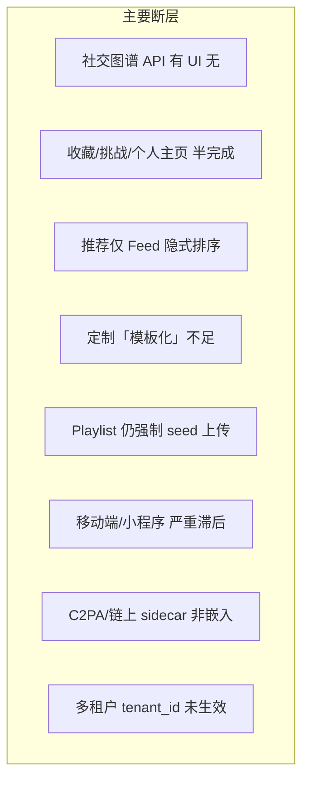
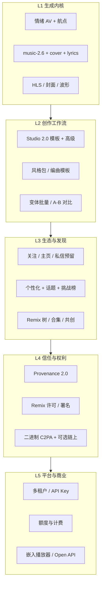
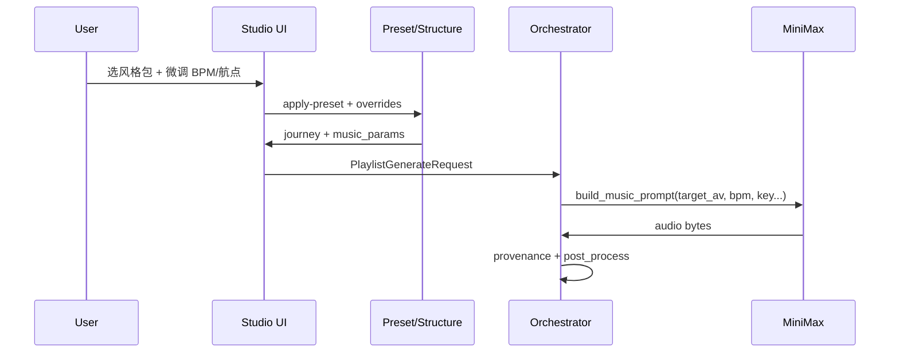
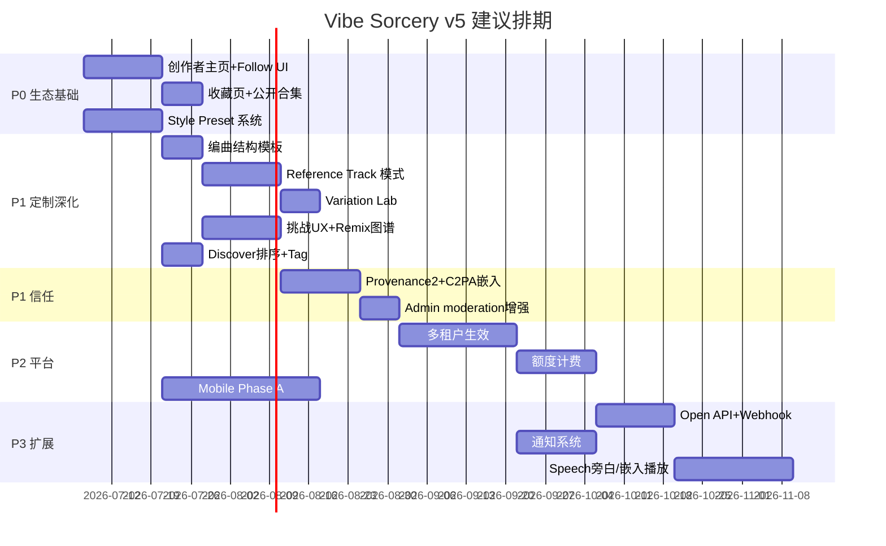

# Vibe Sorcery 产品路线图 v5.0

> **定位**：情绪驱动的 AI 音乐创作平台 —— 从「能生成」到「能定制、能传播、能溯源、能运营」的完整生态。  
> **前提**：v4.0 已完成 Generation Control Stack（航点 + BPM/调性/种子/Remix/Cover + Studio UI）。  
> **原则**：不扩 MiniMax 未文档化字段；自由度通过 prompt 工程 + 官方参数 + 平台层抽象实现。

---

## 1. 现状与下一层目标

### 1.1 已具备（v4.0）

| 层 | 能力 |
|----|------|
| **创作** | Playlist / Single / Vocals / Text Journey；航点 AV；music_params；Cover/Remix |
| **管线** | Essentia 分析 → M3 prompt → music-2.6 → MinIO → HLS/C2PA 后处理 |
| **社区** | Feed、点赞、评论、Remix、举报 |
| **信任** | Provenance 谱系、SHA256 校验、.vibe 导出 |
| **运营** | Admin 统计/用量/Flags/举报；挑战活动后端 |

### 1.2 核心缺口（v5 要补）

> **战略补充**：种子音频不再作为默认路径 —— 见 [PRODUCT_INTENT_FIRST_ARCHITECTURE.md](PRODUCT_INTENT_FIRST_ARCHITECTURE.md)（意图优先 · 零上传门槛）。



| 断层 | 用户感知 | 优先级 |
|------|----------|--------|
| **Playlist 必须 seed** | 「没歌不能玩」最大流失 | **P0** |
| 无 Style Preset 一键 | 参数太专业 | P0 |
| 无创作者主页 / Follow | 无法建立关系 | P0 |
| 收藏无浏览页 | 喜欢无法沉淀 | P0 |
| 挑战参与 UX 分散 | 活动难形成话题 | P1 |
| Remix 链不可视 | 生态传播缺少叙事 | P1 |
| 移动端能力 < Web 30% | 流量入口缺失 | P1 |
| 租户/SaaS 未隔离 | B 端无法交付 | P2 |

---

## 2. 目标架构：五层产品栈



---

## 3. L2 — 音乐定制化（深度设计）

在 v4.0 的 L1–L4 控制栈之上，增加 **「模板 + 参考 + 编排」** 三层，降低专业参数门槛、提高可控上限。

### 3.1 定制能力矩阵

| 定制维度 | 用户入口 | 后端落点 | MiniMax 映射 |
|----------|----------|----------|--------------|
| **情绪曲线** | 曲线预设 / 航点编辑器 | `journey_math` + orchestrator | M3 prompt 中 step AV |
| **风格包** | Genre+Mood 卡片（一键） | `StylePreset` → moods/genres/BPM 默认 | prompt JSON |
| **编曲模板** | Intro→Build→Peak→Outro 结构 | 航点自动生成 + duration 分配 | 每步 duration + AV |
| **参考音频** | 上传 / 选作品「像这首」 | 分析参考轨 AV+moods，插值到 journey | seed + emotion 约束 |
| **人声** | 歌词编辑器 + 语言 | `lyrics` + `lyrics_optimizer` | music-2.6 官方字段 |
| **翻唱** | CoverStudio two-step | `cover_feature_id` + modified_lyrics | music-cover API |
| **Remix 意图** | 自然语言 + 原谱系 prompt | `remix_prompt()` 合并 provenance | M3 + music-2.6 |
| **复现** | Seed 输入 / Regenerate | job hash 或 user seed | `seed` 参数 |
| **导出** | WAV/MP3/HLS/`.vibe` | storage + provenance export | — |

### 3.2 Style Preset 系统（P0）

**问题**：BPM/调性/航点对普通用户仍抽象。  
**方案**：平台维护可版本化的 **Style Preset**（类似 DAW 模板）。

```yaml
# 示例 preset: lo-fi-night
id: lo-fi-night
label: Lo-Fi 深夜
moods: [melancholic, calm, nostalgic]
genres: [lo-fi, chillhop]
bpm_range: [70, 90]
key: Am
duration_preference: medium
default_curve: calm_to_energy
waypoint_template:   # 按 steps 缩放
  - { t: 0.0, arousal: 2, valence: 4 }
  - { t: 0.5, arousal: 4, valence: 5 }
  - { t: 1.0, arousal: 3, valence: 6 }
instrumental_default: true
```

**API**：
- `GET /config/presets` — 列表 + 分类（场景/流派/挑战官方包）
- `POST /studio/apply-preset` — 返回完整 `journey` + `music_params` + 可选 waypoints

**UI**：Create 页顶部「风格包」横向卡片；选中后预填 MusicParamsPanel + 可选航点。

**数据**：新表 `style_presets`（或 JSON 文件 + admin 编辑），挑战可绑定 `preset_id`。

### 3.3 编曲结构模板（P1）

将 journey **steps** 与 **段落语义** 绑定：

| 模板 | steps | 段落映射 |
|------|-------|----------|
| `classic_arc` | 6 | Intro×1 → Verse×2 → Chorus×2 → Outro×1 |
| `dj_set` | 8 | Warmup → Build×3 → Peak×2 → Cooldown×2 |
| `meditation` | 4 | Settle → Deepen → Hold → Release |

实现：`structure_template.py` 根据 steps 数量缩放航点时间与 AV 曲线，写入 `journey_config.structure`。

### 3.4 参考轨模式 Reference Track（P1）

**场景**：「我想要一首**像**《Track X》但走向更欢快」。

流程：
1. 选 `reference_work_id`（或上传）
2. Essentia 分析 → 基准 AV + moods/genres
3. 用户选偏移：`brighter` / `darker` / `more_energy` / 自定义 ΔAV
4. orchestrator 以参考 AV 为 step 0，按 curve 或 waypoints 偏移

**Schema 扩展**：
```json
{
  "reference": {
    "work_id": "uuid",
    "av_offset": { "arousal": +2, "valence": +1 }
  }
}
```

### 3.5 变体实验室 Variation Lab（P1）

**Studio 子模式**：同一 config 生成 N 个 seed 变体（N=3/5），网格试听 + 选主版本发布。

- API：`POST /works/generate/variations` → 单 job 多 work 或 fan-out 子 job
- UI：GenerationProgress 多列预览；「设为正式版」写入 parent 关系

### 3.6 人声与语言扩展（P2）

| 能力 | 说明 |
|------|------|
| 多语言歌词 | `lyrics_language` 贯通 generate + cover preprocess |
| 人声风格 hint | M3 prompt 层描述（非 API 未文档字段）：「气声」「说唱」「合唱」 |
| Speech-2.8 旁白 | 片头/片尾口播 → 与 music 分轨存储（未来） |

### 3.7 定制数据流（统一）



---

## 4. L3 — 生态与发现

### 4.1 创作者身份（P0）

**路由**：`/u/[username]`

| 区块 | 数据 |
|------|------|
| 头部 | avatar, bio, 统计（作品/粉丝/获赞） |
| 作品 | 公开 works + playlists |
| 动态 | 发布的 posts |
| Remix 树 | 以某 work 为根的衍生链（只读图） |

**API 新增**：
- `GET /users/{username}/profile`
- `GET /users/{username}/works?visibility=public`
- `GET /users/{username}/posts`

**Follow 闭环**：
- Discover 卡片关注按钮 → `POST /community/follow/{username}`
- Feed 排序已有 follow 权重（`recommendation.py`），补 UI 即可

### 4.2 收藏与合集（P0）

**路由**：`/collections`

- 展示 `GET /collections` 返回的 bookmark
- 支持「公开合集」→ 类似 Spotify playlist sharing（`Collection.visibility` 字段扩展）

### 4.3 Discover 2.0（P1）

| 功能 | 实现 |
|------|------|
| 排序切换 | latest / popular / personalized（API 已有） |
| 话题 Tag | Post.tags 筛选 `GET /community/feed?tag=` |
| Remix 入口 | 卡片 → Studio（`?seed=` 已有）+ Remix drawer |
| 嵌入播放 | `/packageOps/pages/embed/index?workId=` 轻量播放器 |

### 4.4 挑战运营（P1）

**Challenges 页升级**：
- 挑战详情页内 **一键参赛**（选作品 / 跳转 Studio 用官方 preset）
- 排行榜：按 like_count + entry 时间
- Admin 创建挑战 UI（绑定 `target_curve` + `style_preset_id`）

**增长闭环**：
```
官方 Preset → 挑战 → 用户生成 → 发布 → Feed → Remix 链 → 回流 Studio
```

### 4.5 Remix 生态图谱（P1）

**路由**：`/remix/[workId]` 或 provenance 页增强

- 树状/时间线展示 `parent_work_id` 链
- 节点：封面、作者、AV、moods、「基于此 Remix」按钮
- 统计：衍生深度、总播放量（若后续加 analytics）

### 4.6 通知系统（P2）

| 事件 | 通道 |
|------|------|
| 生成完成 | 站内 + Web Push |
| 被点赞/评论 | 站内 |
| 挑战截止提醒 | 邮件/Web Push |
| Remix 被衍生 | 站内（「你的作品被 Remix 了」） |

**模型**：`notifications(user_id, type, payload, read_at)`

---

## 5. L4 — 信任、权利与溯源 2.0

### 5.1 Provenance 2.0（P1）

| 项 | v4 | v5 |
|----|----|----|
| 参数展示 | prompt/BPM/seed/AV | + waypoints JSON、preset_id、reference |
| 导出 | .vibe bundle | + 可读 PDF 谱系摘要 |
| C2PA | JSON sidecar | **二进制嵌入**（`c2pa-python`） |
| 链上 | mock tx | 可配置 Polygon/蚂蚁链 |

### 5.2 Remix 许可（P2）

Work 发布时选择：
- `allow_remix: bool`
- `attribution_required: bool`
- `commercial_use: enum`（personal / NC / commercial）

Remix API 校验许可；provenance 记录 `license_snapshot`。

### 5.3 内容安全（P1）

- Admin：用户封禁、作品下架、批量处理举报
- 生成前/发布前：敏感词 + 音频时长限制（已有 max_lyrics_length）
- 可选：MiniMax 内容审核回调

---

## 6. L5 — 平台、SaaS 与商业化

### 6.1 多租户（P2）

`tenant_id` 已在 User/Work/Post/Challenge：

1. 所有 list/query 加 `tenant_id` 过滤
2. JWT 含 `tenant_id`；注册时分配或邀请码
3. Admin 按租户看 stats/usage
4. 参考 [deploy/SAAS.md](deploy/SAAS.md) K8s 按租户限流

### 6.2 额度与计费（P2）

| 资源 | 计量 |
|------|------|
| music-2.6 调用 | 次/秒 |
| M3 tokens | ApiUsageLog 已有 |
| 存储 | MinIO 用量 |

**模型**：`user_credits` / `subscription_tier`  
**Gate**：生成前检查余额；Admin 手动充值；Stripe 预留 webhook。

### 6.3 Open API（P2）

- `POST /api/v1/keys` 创建 API Key（scoped: generate/read/feed）
- 文档站：基于 OpenAPI `/docs` 导出
- Webhook：`job.completed` → 第三方 DAW/视频工具

### 6.4 嵌入与分发（P3）

- iframe 播放器 + 「Made with Vibe Sorcery」
- 导出到：下载链接、HLS CDN URL、`.vibe` 文件
- 未来：Spotify/Apple Music 分发对接（非 MiniMax 范畴，独立集成）

---

## 7. 客户端矩阵

| 能力 | Web | Mobile (Expo) | 小程序 (Taro) |
|------|-----|---------------|---------------|
| Studio 全参数 | ✅ v4 | Phase A: preset+playlist | Phase B: 单曲+预设 |
| HLS 播放 | ✅ | Phase A | 原生 audio 组件 |
| 社区完整 | ✅ v4 | Phase A: feed+follow | Phase B: feed |
| 挑战 | 部分 | Phase B | — |
| Provenance | ✅ | Phase B | — |
| 离线草稿 | — | Phase C | — |

**策略**：`packages/api-client` 为唯一 SDK；Taro H5 + 微信小程序共用 `apps/client`。

---

## 8. 实施分期（建议 12 周）



### Phase 5（Week 1–3）— 生态基座 + 风格包
- [ ] `/u/[username]` 主页 + Follow UI
- [ ] `/collections` 收藏浏览
- [ ] `StylePreset` 后端 + Create 风格包 UI
- [ ] Discover 排序切换

### Phase 6（Week 4–6）— 定制深化
- [ ] 编曲结构模板 → 自动航点
- [ ] Reference Track 模式
- [ ] Variation Lab（多 seed 网格）
- [ ] Challenges 页内参赛 + Admin 创建挑战

### Phase 7（Week 7–9）— 生态闭环
- [ ] Remix 衍生树可视化
- [ ] Provenance 2.0 + C2PA 二进制嵌入
- [ ] Admin 用户/作品 moderation
- [ ] Mobile Phase A（Feed + Preset Playlist + HLS）

### Phase 8（Week 10–12）— 平台化
- [ ] 多租户 query 隔离 + 租户 Admin
- [ ] 用户额度与生成 Gate
- [ ] Open API Key + job webhook
- [ ] 通知（生成完成 / 互动）

---

## 9. 数据模型扩展摘要

| 新表/字段 | 用途 |
|-----------|------|
| `style_presets` | 风格包定义 |
| `Collection.visibility` | 公开/私密合集 |
| `Work.allow_remix`, `license` | Remix 许可 |
| `Work.preset_id`, `reference_work_id` | 定制溯源 |
| `Notification` | 站内通知 |
| `ApiKey` | Open API |
| `UserCredits` | 额度 |
| `Post.tags[]` GIN 索引 | 话题筛选 |

---

## 10. 成功指标（KPI）

| 指标 | v5 目标 |
|------|---------|
| 注册 → 首次生成转化率 | > 40% |
| 生成 → 发布转化率 | > 25% |
| Remix 衍生率（公开作品） | > 15% |
| 7 日留存 | > 20% |
| 平均 Studio 参数使用率（非默认 preset） | > 50% |
| API P95 生成 job 完成时间 | < 3min（6 step playlist） |

---

## 11. 风险与约束

1. **MiniMax 配额**：Variation Lab / 批量生成需严格 credits Gate  
2. **Essentia 模型**：Reference Track 依赖分析质量；无模型时降级为 tag 相似度  
3. **C2PA 二进制**：FFmpeg 重封装链路增加 worker 时间  
4. **多租户**：迁移需 backfill `tenant_id` 默认值  
5. **小程序**：音频播放与文件上传受平台政策限制，功能子集需产品妥协  

---

## 12. 与现有文档关系

| 文档 | 关系 |
|------|------|
| [MINIMAX_MODELS.md](MINIMAX_MODELS.md) | v4 Studio 参数表；v5 增加 preset/reference 映射说明 |
| [PHASE3.md](PHASE3.md) | HLS/C2PA/挑战基础；v5 在其上扩展 UX 与嵌入 |
| [deploy/SAAS.md](deploy/SAAS.md) | 多租户/计费/小程序的技术落地参考 |
| v4 Music Generation Freedom Plan | 已完成；v5 本文件为其生态与定制延伸 |

---

**下一步建议（若继续开发）**：**Phase 5A Intent-First**（IF-01~07：无 seed Playlist + Studio 重组）→ Phase 5B 生态（主页/收藏/Preset UI）。

---

## 0. Intent-First 原则（必读）

**默认用户路径不包含上传种子音乐。** 见 [PRODUCT_INTENT_FIRST_ARCHITECTURE.md](PRODUCT_INTENT_FIRST_ARCHITECTURE.md)。

| 旧默认 | 新默认 |
|--------|--------|
| 上传 seed → 分析 → 生成 | Preset + 一句话 → 生成 |
| SeedPicker 首屏 | Advanced「音频锚定（可选）」 |
| Playlist 400 无 file | `prompt_journey` 无 seed 可生成 |

---

---

## 13. 完整规格书（Master Spec）

v5 路线图侧重战略与排期；**每个功能的详细 UX、API、数据模型与验收标准** 见：

👉 **[PRODUCT_SPEC_COMPLETE.md](PRODUCT_SPEC_COMPLETE.md)**

该文档包含：

- **全功能矩阵**（80+ 项：✅ / ◐ / ⬜）
- **4 条端到端用户旅程**（新手 / Remix / 挑战 / 创作者）
- **Studio / 生态 / 媒体管线 / 推荐 / 安全** 分模块规格
- **完整 API 缺口清单** 与 **Web 路由目标表**
- **数据模型演进** 与 **Phase 5–9 验收总表**

### 13.1 全系统完成度快照（目标 v5 结束）

| 域 | 当前约 | v5 目标 |
|----|--------|---------|
| 创作 Studio | 85% | 95%（+Preset/Structure/Reference/Variation） |
| 生态社区 | 55% | 85%（+主页/Follow/收藏/挑战闭环） |
| 溯源信任 | 70% | 90%（+C2PA 嵌入/许可） |
| 平台 SaaS | 25% | 60%（+租户/额度/API） |
| Mobile/小程序 | 20% | 45% / 25% |

### 13.2 与 v4 / Phase3 文档关系

| 版本 | 文档 | 状态 |
|------|------|------|
| v4.0 | Music Generation Freedom Plan | ✅ 已实现 |
| v3.0 | PHASE3.md | ✅ 基础设施 |
| v5.0 | PRODUCT_ROADMAP_v5.md | 📋 战略 |
| v5.0 | PRODUCT_SPEC_COMPLETE.md | 📋 全量规格 |
| v5.0 | [PRODUCT_IMPLEMENTATION_BLUEPRINT.md](PRODUCT_IMPLEMENTATION_BLUEPRINT.md) | 📋 权限/状态机/81项清单/迁移 |
| v5.0 | [PRODUCT_UX_DESIGN_SYSTEM.md](PRODUCT_UX_DESIGN_SYSTEM.md) | 📋 完整 UX：IA、Studio 线框、组件、状态、a11y |
| v5.0 | [PRODUCT_INTENT_FIRST_ARCHITECTURE.md](PRODUCT_INTENT_FIRST_ARCHITECTURE.md) | 📋 **意图优先**：去 seed 核心化、prompt_journey、Studio 重组 |
