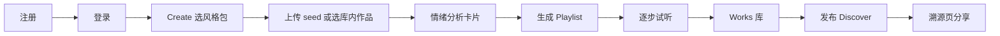
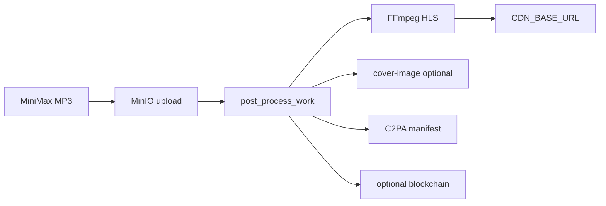
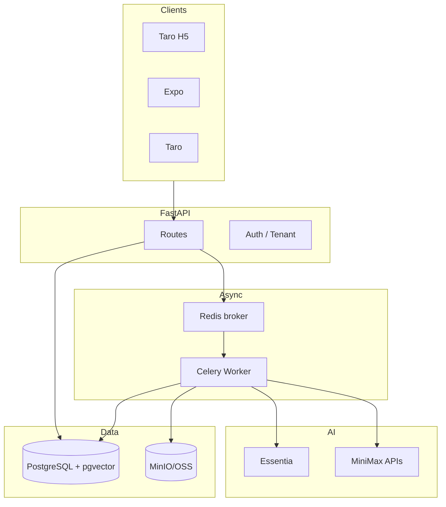

# Vibe Sorcery 完整产品规格书（Master Spec）

> 与 [PRODUCT_ROADMAP_v5.md](PRODUCT_ROADMAP_v5.md) 配套：路线图讲「做什么、何时做」；本文讲「每个功能做到什么程度、如何验收」。  
> 覆盖范围：**创作 · 定制 · 生态 · 信任 · 平台 · 客户端 · 运维** 全模块。

---

## 0. 产品愿景与边界

### 0.1 一句话

**用情绪（Arousal–Valence）驱动 AI 音乐创作，并以可验证溯源连接创作者社区。**

### 0.2 核心用户画像

|  persona | 目标 | 关键路径 |
|----------|------|----------|
| **探索者** | 快速出片、少参数 | 风格包 → 一键 Playlist → 发布 |
| **创作者** | 精细控制旅程与参数 | Journey 航点 + BPM/调性 + Variation Lab |
| **Remixer** | 基于他人作品衍生 | Discover → Remix/Cover → 溯源链 |
| **运营者** | 话题与挑战 | Admin 挑战 + Preset +  moderation |
| **B 端租户** | 白标 / API 集成 | 多租户 + Open API + 额度 |

### 0.3 不在产品内核（独立集成或 v6+）

- Spotify / Apple Music **商店分发**（需第三方 distributor）
- 全功能 DAW 编辑器（仅参数级 + 歌词级定制）
- 实时协同编辑（Google Docs 式）
- 自研音乐模型（依赖 MiniMax + Essentia）

### 0.4 设计铁律

1. MiniMax 仅用[官方文档化参数](MINIMAX_MODELS.md)
2. 所有生成控制写入 `ProvenanceRecord.music_request` / `m3_request`
3. 异步任务一律可 cancel、可 WS 追踪、可 poll 降级
4. Taro-only：H5 Web + 微信小程序共用 `apps/client`，SDK 为 `packages/api-client`
5. **Intent-First**：种子音频非默认路径；`prompt_journey` 为 Playlist 默认模式（见 [PRODUCT_INTENT_FIRST_ARCHITECTURE.md](PRODUCT_INTENT_FIRST_ARCHITECTURE.md))

---

## 1. 全功能矩阵（目标态）

图例：**✅ 已实现** · **◐ 部分** · **⬜ 待做**

### 1.1 账户与身份

| 功能 | API | Web | Mobile | 状态 | v5 目标 |
|------|-----|-----|--------|------|---------|
| 注册 / 登录 JWT | ✅ | ✅ | ✅ | ✅ | — |
| `/auth/me` | ✅ | ✅ | ◐ | ✅ | — |
| 偏好 moods/genres | ✅ | ✅ | ⬜ | ✅ | Settings 动态拉 `/emotion/tags` |
| 资料 display_name/bio | ✅ | ◐ | ⬜ | ◐ | **Profile 编辑页** |
| Avatar 上传 | ⬜ | ⬜ | ⬜ | ⬜ | MinIO presigned upload |
| 公开主页 `/u/[username]` | ⬜ | ⬜ | ⬜ | ⬜ | P0 |
| Follow / 粉丝列表 | ✅ API | ⬜ | ⬜ | ◐ | P0 |
| 封禁 / 注销 | ⬜ | ⬜ | ⬜ | ⬜ | Admin P1 |

### 1.2 Studio 创作

| 模式 | 能力 | 状态 | v5+ |
|------|------|------|-----|
| **Playlist** | seed 文件/作品、steps、curve、waypoints、music_params | ✅ | + Preset + Structure |
| **Track (Single)** | text_intent、bpm、key、moods、genres、seed | ✅ | + Reference |
| **Vocals** | 歌词生成/编辑、optimizer、language | ✅ | + 人声 hint |
| **Text Journey** | plan_journey → waypoints → playlist | ✅ | + Preset 绑定 |
| **Variation Lab** | 多 seed 网格 | ⬜ | P1 |
| **Music-Cover** | one_step / two_step、modified_lyrics | ✅ | + 许可校验 |
| **Cover Image** | image-01 专辑图 | ✅ API | Works 卡片展示 post-process 状态 |
| **Regenerate** | 同参不同 seed | ✅ | Variation 子集 |
| **Job 进度** | WS + poll + cancel + 逐步试听 | ✅ | + 通知 |
| **草稿保存** | localStorage / 服务端 | ⬜ | P2 StudioDraft 表 |

### 1.3 情绪与旅程

| 功能 | 状态 | v5+ |
|------|------|-----|
| Essentia 音频分析 | ✅（模型缺失则 fallback） | 模型安装文档 + 健康检查 |
| AV 航点编辑器 | ✅ | 2–12 航点增删、snap 曲线 |
| 曲线 preset（4+） | ✅ | 与挑战/ Preset 统一配置源 |
| 线性/航点插值 | ✅ | + ease 曲线可选 |
| LLM 文本规划旅程 | ✅ | 规划结果可编辑再生成 |
| Reference Track | ⬜ | P1 |
| 结构模板 classic/dj/meditation | ⬜ | P1 |

### 1.4 作品与播放

| 功能 | 状态 | v5+ |
|------|------|-----|
| Works 库（私有） | ✅ | 筛选/排序/批量删除 |
| Playlists 列表/详情 | ✅ | 公开分享、编辑标题 |
| HLS 流式 | ✅ | Mobile HLS 播放器 |
| 波形预览 | ◐ 后端可生成 | 播放器 UI |
| 下载 MP3 | ◐ presigned | 一键下载按钮 |
| 可见性 private/public | ✅ | unlisted 链接分享 |
| post-process 状态 UI | ⬜ | HLS/封面/C2PA badge |

### 1.5 社区与发现

| 功能 | 状态 | v5+ |
|------|------|-----|
| 发布 Post | ✅ | 发布时选 Remix 许可 |
| Feed personalized | ✅ | 排序 UI latest/popular |
| Like | ✅ | — |
| Comment | ✅ | @mention P2 |
| Remix | ✅ | 图谱 + 许可 |
| Report | ✅ | — |
| Tag 话题筛选 | ◐ DB 有 tags | `?tag=` API + UI |
| 搜索用户/作品 | ⬜ | P2 全文/标签 |
| 嵌入播放器 `/embed` | ⬜ | P2 |
| Collections 浏览 | ✅ API | **/collections 页 P0** |

### 1.6 挑战

| 功能 | 状态 | v5+ |
|------|------|-----|
| 列表 / 详情 / entries | ✅ | — |
| 参赛 enter | ✅ API | **挑战页内 UI P1** |
| Admin 创建 | ✅ API | Admin UI P1 |
| 排行榜 | ⬜ | like + 时间加权 P1 |
| 绑定 Style Preset | ⬜ | P1 |
| 自动截止 / 颁奖 | ⬜ | P2 |

### 1.7 溯源与信任

| 功能 | 状态 | v5+ |
|------|------|-----|
| Lineage 树 | ✅ | Remix 图可视化 P1 |
| SHA256 verify | ✅ | — |
| .vibe / json export | ✅ | PDF 摘要 P2 |
| C2PA sidecar | ✅ | **二进制嵌入 P1** |
| 链上 anchor | ◐ mock | 真实 RPC P2 |
| Remix 许可字段 | ⬜ | P2 |

### 1.8 Admin 与平台

| 功能 | 状态 | v5+ |
|------|------|-----|
| Stats / Usage | ✅ | 图表 + 按模型聚合 |
| Reports | ✅ | 用户/作品下架 P1 |
| Feature Flags | ✅ | 生成路径也 gate |
| Seed 默认数据 | ✅ | — |
| 用户管理 | ⬜ | P1 |
| Style Preset CRUD | ✅ | Admin 预设管理 |
| 多租户隔离 | ◐ DB | Query 全链路 P2 |
| API Key / Webhook | ✅ | Settings H5 |
| 额度 Credits | ✅ | Welcome 25 · 签到/任务 · 软付费墙 · Billing Hub |

### 1.9 客户端（Taro-only）

| 端 | 完成度 | 目标 |
|----|--------|------|
| H5 Web（`apps/client` build:h5） | ~85% | 补主页/收藏/预设/嵌入 |
| 微信小程序（`apps/client` build:weapp） | ~80% | 与 H5 功能对齐、包体积优化 |
| 共享 SDK | `packages/api-client` | OpenAPI sync + 双端一致 |

---

## 2. 端到端用户旅程（必须全部打通）

### 2.1 旅程 A：新手首次创作



**断点修复（待做）**：无 seed 时引导；生成失败重试；发布前 post-process 完成提示。

### 2.2 旅程 B：Remix 生态

```
Discover 听曲 → 查看溯源 → Remix 意图 → Job 进度 → 新 Work
→ 发布 → 原作者通知 → Remix 树可见 → 他人继续 Remix
```

### 2.3 旅程 C：挑战活动

```
Challenges 列表 → 详情读规则+官方 Preset → Studio 预填参数
→ 生成 → 挑战页一键投稿 → Feed 带 hashtag → 排行榜
```

### 2.4 旅程 D：创作者经营

```
完善 Profile → 公开 Works/Playlist → 粉丝 Follow
→ 个性化 Feed 曝光 → Collections 被收藏 → API 额度商业化
```

---

## 3. Studio 模块详细规格

### 3.1 统一 Studio Shell

所有创作入口（`/create`、`/journey`、Discover「Studio」链接）共享：

| 区域 | 组件 | 行为 |
|------|------|------|
| 顶栏 | Mode 切换 | playlist / track / vocals / textJourney |
| 风格 | PresetCarousel | 选中 → 调 `apply-preset` |
| 种子 | SeedPicker | 文件 **xor** seed_work_id |
| 分析 | EmotionAnalysisCard | 分析后可「应用到生成」 |
| 音乐 | MusicParamsPanel | BPM、key、duration；Advanced 折叠 |
| 情绪 | WaypointEditor / CurveSelect | 互斥：preset 航点可覆盖 curve |
| 歌词 | LyricsEditor | vocals 模式 |
| 进度 | GenerationProgress | WS、cancel、step 试听 |
| 配置源 | `GET /config/platform` | 启动拉 defaults |

### 3.2 Playlist 模式验收标准

- [ ] 提交 payload 含 `waypoints_json` + `music_params` + `steps` + `target_curve`
- [ ] job.config 与 orchestrator 读到的 `duration_preference` 一致
- [ ] 每步 provenance 含 `target_av`、waypoints 快照
- [ ] 6 step job P95 < 3min（mock 除外）
- [ ] cancel 后 worker 协作式停止

### 3.3 Single / Vocals 验收标准

- [ ] `text_intent` 出现在 M3 prompt（非仅 fallback）
- [ ] bpm/key 覆盖 prompt JSON
- [ ] seed 可复现（同 seed 同 prompt mock 下 hash 一致）
- [ ] `seed_work_id` 权限：`can_use_work_as_seed`

### 3.4 Style Preset 规格（P0 必做）

**数据模型 `style_presets`**

```sql
id TEXT PK,
label TEXT,
category TEXT,          -- scene | genre | challenge | official
moods JSONB,
genres JSONB,
bpm_range INT[2],
key TEXT,
duration_preference TEXT,
default_curve TEXT,
waypoint_template JSONB,  -- [{t, arousal, valence, description?}]
instrumental_default BOOL,
tenant_id TEXT,
sort_order INT,
enabled BOOL
```

**API**

| Method | Path | 说明 |
|--------|------|------|
| GET | `/config/presets?category=` | 公开列表 |
| GET | `/config/presets/{id}` | 详情 |
| POST | `/studio/apply-preset` | body: `{preset_id, steps?, overrides?}` → journey + music_params + waypoints |
| POST | `/admin/presets` | CRUD（admin） |

**apply-preset 算法**

1. 读取 preset
2. `steps` 默认 6，clamp 2–12
3. waypoint_template 按 `t∈[0,1]` 映射到 step 0…steps-1
4. overrides 浅合并 music_params
5. 返回可直传 `generate/playlist` 的字段

### 3.5 Variation Lab 规格（P1）

**请求**

```json
POST /works/generate/variations
{
  "base": { /* SingleGenerateRequest 或 playlist config */ },
  "count": 3,
  "mode": "single" | "playlist"
}
```

**响应**：父 job + `variation_ids[]`；result.completed_steps 含全部变体。

**UI**：3 列 AudioPlayer + 「选为主版本」→ 其余标为 `variant_of`。

### 3.6 Reference Track 规格（P1）

```json
"journey": {
  "reference": {
    "work_id": "uuid",
    "av_offset": { "arousal": 2, "valence": 1 },
    "mood_bias": ["uplifting"]
  }
}
```

Orchestrator step 0 分析参考轨；step i 目标 AV = reference_AV + offset × curve(i/steps)。

---

## 4. 生态模块详细规格

### 4.1 创作者主页 `/u/[username]`

**API**

```
GET /users/{username}/profile
  → { username, display_name, bio, avatar_url, stats: { works, followers, following, likes }, is_following? }

GET /users/{username}/works?visibility=public&limit&offset

GET /users/{username}/playlists?visibility=public

GET /users/{username}/posts?limit&offset
```

**页面区块**：Header · Tabs(Works | Playlists | Posts) · Remix 亮点（optional）

**验收**：未登录可看公开内容；Follow 按钮调已有 API；链接从 Discover 作者名跳转。

### 4.2 收藏 `/collections`

**扩展 Collection**

```python
visibility: str = "private"  # private | public
title: str = "My Collection"
```

**API 扩展**

```
GET /collections → 含 work 摘要
POST /collections/{work_id} 已有
PATCH /collections → 批量改 title/visibility（P1）
GET /users/{username}/collections?visibility=public
```

### 4.3 Discover 2.0

| 控件 | API |
|------|-----|
| 排序 SegmentedControl | `GET /community/feed?sort=` |
| Tag 筛选 | `GET /community/feed?tag=` |
| 搜索框 | `GET /search?q=`（P2 新路由） |

**Feed 卡片必含**：播放 · 赞 · 评论 · Remix · 溯源 · 作者链接 · Follow

### 4.4 Remix 图谱

**API**

```
GET /works/{id}/remix-tree?depth=5
→ { root, nodes: [{work_id, parent_id, author, title, cover_url, step_index}], edges }
```

**UI**：provenance 页 Tab「Remix 树」；节点点击播放/跳转 Studio。

### 4.5 通知（P2）

```python
class Notification:
    user_id, type, payload JSONB, read_at, created_at

# types: job_completed, post_liked, post_commented, new_follower, work_remixed, challenge_ending
```

```
GET /notifications?unread_only=
POST /notifications/{id}/read
POST /notifications/read-all
```

Web：顶栏铃铛 + 下拉；Mobile：push token 注册。

---

## 5. 媒体与后处理管线



### 5.1 post_process 规格

触发：生成完成自动 enqueue；或 `POST /studio/works/{id}/post-process`

| 步骤 | Flag | 输出字段 |
|------|------|----------|
| HLS | `hls_streaming` | work.hls_url |
| 封面 | 默认 on | work.cover_url |
| C2PA | `c2pa_provenance` | provenance.c2pa_manifest |
| 链上 | BLOCKCHAIN_ANCHOR_ENABLED | provenance.blockchain_tx_hash |

**UI**：WorkRow badge：`HLS ✓` `Cover ✓` `Verified ✓`

### 5.2 C2PA 2.0 路径

1. v4：JSON sidecar 存 MinIO
2. v5：集成 `c2pa-python` 嵌入 MP3/M4A
3. verify 端点：解析二进制 manifest + hash 对比

### 5.3 存储与 CDN

| 环境 | S3 endpoint | CDN |
|------|-------------|-----|
| 本地 | MinIO | 直链 |
| 生产 | OSS/COS | CDN_BASE_URL |

**生命周期**：未发布 private work 90 天清理（P2 cron）；job 临时 seed 24h 清理。

---

## 6. 推荐与排序

### 6.1 当前算法（`recommendation.py`）

```
score = like×2 + comment + follow_boost + preference_similarity(embedding, tags)
```

### 6.2 v5 增强

| 信号 | 权重建议 |
|------|----------|
| 情绪 embedding cosine | 高 |
| mood/genre tag 重叠 | 中 |
| follow 作者 | 高 |
| 新鲜度 decay | 中 |
| 挑战 entry | 提权 |

### 6.3 验收

- [ ] `/emotion/analyze` 写 embedding 时 personalized 与 latest 结果不同
- [ ] Settings 改 preference 后 feed 排序变化（同账号 A/B）

---

## 7. 安全、合规与 moderation

| 项 | 实现 |
|----|------|
| 鉴权 | JWT Bearer；WS `?token=` |
| 资源授权 | work owner / visibility / seed 复用规则 |
| 速率限制 | nginx/API middleware：register 5/min，generate 10/h/user（P1） |
| 歌词/意图敏感词 | 发布前 filter（P1） |
| 举报 | report → admin queue → hide_post / ban_user |
| 审计 | ApiUsageLog + admin action log（P2） |
| GDPR | 账号删除 cascade（P2） |

---

## 8. 技术架构（服务边界）



### 8.1 Job 类型一览

| job_type | Task | 超时建议 |
|----------|------|----------|
| playlist | generate_playlist_task | 30min |
| single | generate_single_task | 10min |
| remix | generate_single_task(remix) | 10min |
| cover | generate_cover_task | 15min |
| post_process | post_process_work_task | 5min |
| variations | fan-out（P1） | 30min |

### 8.2 可观测性（P1）

- 结构化日志：job_id, user_id, step, latency_ms
- Metrics：Prometheus `/metrics` — job_success, minimax_errors, queue_depth
- Tracing：OpenTelemetry span per MiniMax call（P2）

### 8.3 测试策略

| 层 | 内容 |
|----|------|
| 单元 | journey_math, preset apply, recommendation score |
| 集成 | schema→worker config, orchestrator mock MiniMax |
| E2E | Playwright：login → create preset playlist → wait job → publish |
| 负载 | 10 并发 playlist job queue 不丢 |

---

## 9. 完整 API 缺口清单

### 9.1 必须新增（P0–P1）

| Method | Path | 用途 |
|--------|------|------|
| GET | `/users/{username}/profile` | 主页 |
| GET | `/users/{username}/works` | 公开作品 |
| GET | `/users/{username}/posts` | 动态 |
| GET | `/config/presets` | 风格包 |
| POST | `/studio/apply-preset` | 应用风格包 |
| GET | `/works/{id}/remix-tree` | Remix 图 |
| GET | `/community/feed?tag=` | 话题（若未实现） |
| PATCH | `/collections/{id}` | 合集元数据 |
| POST | `/admin/presets` | Preset CRUD |
| POST | `/admin/users/{id}/ban` | 封禁 |

### 9.2 应该新增（P2）

| Method | Path | 用途 |
|--------|------|------|
| POST | `/works/generate/variations` | 变体 |
| GET | `/search` | 搜索 |
| GET | `/notifications` | 通知 |
| POST | `/api-keys` | Open API |
| POST | `/webhooks` | 回调注册 |
| GET | `/users/me/credits` | 额度 |
| POST | `/uploads/presign` | Avatar/seed |

---

## 10. 完整页面路由目标（Web）

| 路由 | 页面 | 优先级 |
|------|------|--------|
| `/` | 首页 | ✅ |
| `/login` | 登录 | ✅ |
| `/create` | Studio | ✅ + Preset |
| `/journey` | Emotion Map | ✅ |
| `/works` | 作品库 | ✅ |
| `/playlists` | 列表 | ✅ |
| `/playlists/[id]` | 详情 | ✅ |
| `/community` | Discover | ✅ + sort/tag |
| `/collections` | 收藏 | **P0** |
| `/challenges` | 挑战 | ✅ + enter |
| `/challenges/[slug]` | 挑战详情 | **P1** |
| `/u/[username]` | 创作者主页 | **P0** |
| `/provenance/[workId]` | 溯源 | ✅ + remix tree |
| `/remix/[workId]` | Remix 图（可选独立） | P1 |
| `/settings` | 偏好 | ✅ + profile |
| `/settings/profile` | 资料编辑 | P0 |
| `/packageOps/pages/admin/index` | 后台 | ✅ + presets/users |
| `/packageOps/pages/embed/index?workId=` | 嵌入播放 | ✅ |
| `/notifications` | 通知中心 | P2 |

---

## 11. 数据模型演进（完整）

### 11.1 现有表（保持）

User, UserPreference, Work, Playlist, PlaylistTrack, GenerationJob, ProvenanceRecord, EmotionEmbedding, ApiUsageLog, Post, Like, Comment, Follow, Collection, Report, Challenge, ChallengeEntry, FeatureFlag

### 11.2 v5 新增表

| 表 | 关键字段 |
|----|----------|
| `style_presets` | 见 §3.4 |
| `notifications` | user_id, type, payload, read_at |
| `studio_drafts` | user_id, mode, payload JSONB, updated_at |
| `api_keys` | user_id, key_hash, scopes, last_used |
| `user_credits` | user_id, balance, tier |
| `webhook_endpoints` | user_id, url, secret, events[] |
| `admin_audit_log` | actor_id, action, target, meta |

### 11.3 Work 扩展字段

```python
preset_id: str | None
reference_work_id: UUID | None
allow_remix: bool = True
license: JSONB  # {attribution_required, commercial_use}
post_process_status: JSONB  # {hls, cover, c2pa, done_at}
play_count: int = 0
```

### 11.4 Collection 扩展

```python
title: str
visibility: str = "private"
```

---

## 12. 分期交付与验收总表

### Phase 5（P0，3 周）

| # | 交付物 | 验收 |
|---|--------|------|
| 5.1 | 创作者主页 + Follow UI | 从 Feed 关注后 personalized feed 出现该作者作品 |
| 5.2 | `/collections` | 收藏/取消/列表播放 |
| 5.3 | Style Preset 全栈 | 选 Lo-Fi preset 后 BPM/航点自动填充且生成 provenance 含 preset_id |
| 5.4 | Discover sort | 三种排序 UI 可切换 |
| 5.5 | Settings profile | bio/display_name 可改 |

### Phase 6（P1，3 周）

| # | 交付物 | 验收 |
|---|--------|------|
| 6.1 | Structure templates | 选 DJ 模板 8 step 航点自动生成 |
| 6.2 | Reference track | 选参考作品 + brighter → AV 偏移可溯源 |
| 6.3 | Variation Lab | 3 变体同屏试听 |
| 6.4 | Challenge 详情 + enter | 挑战页完成投稿无 window.prompt |
| 6.5 | Remix tree | 3 层衍生树可点击播放 |

### Phase 7（P1，3 周）

| # | 交付物 | 验收 |
|---|--------|------|
| 7.1 | C2PA 二进制嵌入 | verify 通过嵌入 manifest |
| 7.2 | Admin moderation | 封禁用户后无法登录 |
| 7.3 | post-process badges | Works 显示 HLS/Cover 状态 |
| 7.4 | Mobile Phase A | Expo feed+follow+preset playlist |

### Phase 8（P2，3 周）

| # | 交付物 | 验收 |
|---|--------|------|
| 8.1 | 多租户隔离 | 两 tenant 互不可见 work |
| 8.2 | Credits gate | 余额不足 402 |
| 8.3 | Open API + webhook | 外部 key 创建 single job 并收到 completed 回调 |
| 8.4 | Notifications | 生成完成 bell 红点 |

### Phase 9+（v6 展望）

- Speech-2.8 片头片尾旁白轨
- Hailuo 音乐视频（封面 + 频谱可视化）
- 协作 Playlist（多人贡献航点）
- DAW 插件（export .vibe → Ableton clip 元数据）
- 真实 Spotify distributor 集成

---

## 13. KPI 与质量门槛

| 类别 | 指标 |
|------|------|
| 功能完整度 | 上表 P0 项 100% 勾选 |
| 可靠性 | job 失败率 < 2%（非用户 cancel） |
| 性能 | API P95 < 200ms（非生成）；playlist P95 < 3min |
| 安全 | 0 未授权 seed/cross-tenant 访问 |
| 体验 | Lighthouse 可访问性 ≥ 90 |

---

## 14. 文档索引

| 文档 | 内容 |
|------|------|
| [PRODUCT_ROADMAP_v5.md](PRODUCT_ROADMAP_v5.md) | 战略分层 + 12 周甘特 |
| **本文** | 全模块规格 + 验收 |
| [PRODUCT_IMPLEMENTATION_BLUEPRINT.md](PRODUCT_IMPLEMENTATION_BLUEPRINT.md) | 权限矩阵、Job 状态机、81 项 ticket、迁移/商业化/埋点 |
| [PRODUCT_UX_DESIGN_SYSTEM.md](PRODUCT_UX_DESIGN_SYSTEM.md) | UX 原则、IA、Studio/Discover 线框、组件、空错态、a11y、UX KPI |
| [MINIMAX_MODELS.md](MINIMAX_MODELS.md) | 模型与 Studio 参数 |
| [PLATFORM.md](PLATFORM.md) | 架构与启动 |
| [PHASE3.md](PHASE3.md) | HLS/C2PA/挑战已实现项 |
| [deploy/SAAS.md](deploy/SAAS.md) | 生产与多租户 |

---

**推荐实施顺序**：Phase 5.1 → 5.3 → 5.2 → 5.4（生态 + 定制并行）→ Phase 6 定制深化 → Phase 7 信任与 Mobile → Phase 8 平台化。

如需进入开发，请指定 Phase 编号或直接说「从 Phase 5 开始实现」。
