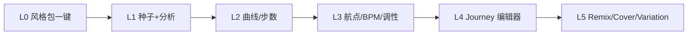

# Vibe Sorcery UX 设计规范与体验蓝图

> **规划文档四部曲**  
> 1. [PRODUCT_ROADMAP_v5.md](PRODUCT_ROADMAP_v5.md) — 战略与排期  
> 2. [PRODUCT_SPEC_COMPLETE.md](PRODUCT_SPEC_COMPLETE.md) — 功能规格与验收  
> 3. [PRODUCT_IMPLEMENTATION_BLUEPRINT.md](PRODUCT_IMPLEMENTATION_BLUEPRINT.md) — 81 项 ticket、权限、迁移  
> 4. **本文** — 完整用户体验设计：原则、IA、页面、组件、状态、无障碍、动效  

---

## 1. UX 愿景与原则

### 1.1 体验一句话

**「像专业工具一样清晰，像音乐 App 一样可听；复杂参数在需要时才出现。」**

### 1.2 六大原则

| 原则 | 含义 | 反模式（禁止） |
|------|------|----------------|
| **Progressive disclosure** | 默认简单（风格包 + 生成），Advanced 折叠 | 一屏堆满 BPM/航点/曲线 |
| **Listen-first** | 任何生成结果 1 次点击内可试听 | 完成才跳转 Works 才能听 |
| **Traceable by default** | 溯源链接常置，不藏深 | 仅 Admin 能看参数 |
| **Tool-grade neutral** | zinc 深色 + teal 单 accent | 紫色渐变、「AI slop」风 |
| **Forgiving flows** | 401/失败有明确下一步 | `window.alert`、静默失败 |
| **Consistent shell** | 全站同一 Nav、Card、Toast、Empty | 每页自创布局 |

### 1.3 设计 Token（延续 v2，扩展语义色）

```css
/* 已有 globals.css — 扩展建议 */
--success: #4ade80;
--warning: #fbbf24;
--info: #60a5fa;
--focus-ring: 0 0 0 2px var(--bg), 0 0 0 4px var(--accent);
--shadow-sm: 0 1px 2px rgba(0,0,0,.4);
--shadow-md: 0 4px 12px rgba(0,0,0,.5);
--max-content: 720px;   /* Studio 主列 */
--max-wide: 1120px;     /* Discover / Admin */
--player-height: 48px;
```

**Typography 层级**

| Token | 用途 | 规格 |
|-------|------|------|
| `micro-label` | 区块标签 | 0.6875rem, uppercase, muted, letter-spacing .06em |
| `h1` PageHeader | 页标题 | 2rem / 600 |
| `h2` Card 标题 | 卡片 | 1.25rem |
| `body` | 正文 | 0.9375rem / line-height 1.6 |
| `meta` | 次要信息 | 0.8125rem / muted |

---

## 2. 信息架构（IA）与导航

### 2.1 站点地图（目标态）

```mermaid
flowchart TB
  HOME[首页 /]
  subgraph create [创作]
    STU[/create Studio]
    JOU[/journey Emotion map]
  end
  subgraph library [库]
    WRK[/works]
    PL[/playlists]
    COL[/collections]
  end
  subgraph social [社区]
    DIS[/community Discover]
    CHL[/challenges]
    CHD[/challenges/slug]
  end
  subgraph identity [身份]
    PROF[/u/username]
    SET[/settings]
    NOT[/notifications]
  end
  subgraph trust [信任]
    PRV[/provenance/workId]
    RMX[/remix/workId]
  end
  HOME --> create
  HOME --> social
  STU --> JOU
  DIS --> PROF
  WRK --> PRV
```

### 2.2 主导航（SiteNav 目标结构）

```
[Logo]  Create ▾   Library ▾   Social ▾   [🔔] [Avatar ▾]

Create:   Studio | Emotion map
Library:  Works | Playlists | Collections
Social:   Discover | Challenges
Avatar:   我的主页 | Settings | Admin | 退出
```

**移动端**：汉堡菜单同结构；底部可选 **Tab Bar**（Phase 7 Mobile）：Create · Discover · Library · Me

### 2.3 全局布局网格

| 页面类型 | container | 列 |
|----------|-----------|-----|
| Studio / Settings | `container` max 720px | 单栏 + 右侧 Sticky「生成摘要」(P1) |
| Discover / Works | `container--wide` 1120px | 主 feed + 侧栏（排序/Tag） |
| Provenance | wide | 时间线单列 |
| Admin | wide | StatGrid + 表格 |

---

## 3. 用户分层与体验路径

### 3.1 复杂度阶梯（Critical UX Model）



| 层级 | 用户 | 默认 UI | 页面 |
|------|------|---------|------|
| L0 | 新手 | Preset + 生成（零上传） | `/create` |
| L1 | 探索者 | + 改一句话 intent | `/create` |
| L2 | 常规创作者 | + steps/curve | Quick Journey |
| L3 | 进阶 | Advanced BPM/航点 | `/create` |
| L4 | 专家 | 全屏 AV 平面 | `/journey` |
| L5 | Audio Anchor | 可选上传/选作品 | Advanced |
| L6 | Remixer | Cover/Remix | Works / Discover |

**规则**：L0–L2 不强制登录浏览；**生成/发布**必须登录（AuthBanner + toast，已实现）。

### 3.2 首次访问 Onboarding（P1 待建）

**触发**：注册后 7 日内首次进 `/create`，localStorage `onboarding_done` 未设。

**3 步 Coach Mark（非 modal 阻塞）**：

1. 「选一种风格」→ 指向 PresetCarousel  
2. 「用一句话描述感觉」→ IntentInput  
3. 「生成后可逐步试听」→ GenerationProgress 区域  

跳过按钮永久关闭。可选：首页 CTA「30 秒体验」→ 预填 demo preset + mock 生成（需 `DEV_MOCK`）。

---

## 4. Studio 体验设计（核心）

### 4.1 页面结构（Intent-First 线框）

> 详见 [PRODUCT_INTENT_FIRST_ARCHITECTURE.md §5](PRODUCT_INTENT_FIRST_ARCHITECTURE.md)

```
┌─────────────────────────────────────────────────────────┐
│ PageHeader: Studio · 描述情绪，选风格，即可生成            │
├─────────────────────────────────────────────────────────┤
│ Mode: [Quick Track★|Quick Journey|Text Journey|Vocals]   │
│ ★ PresetCarousel + IntentInput（主区域，无 SeedPicker）   │
│ 快捷：steps · curve · instrumental                       │
│ ▼ Advanced：BPM/航点 · AudioAnchorPanel（可选）          │
│ GenerationProgress                                       │
└─────────────────────────────────────────────────────────┘
```

### 4.2 模式切换 UX

| 模式 | 主字段 | 隐藏字段 | 默认 Preset |
|------|--------|----------|-------------|
| Playlist | seed, steps, curve | lyrics | lo-fi / calm arc |
| Track | text_intent, optional bpm | waypoints | electronic |
| Vocals | lyrics, theme | curve | pop vocal |
| Text Journey | 文本描述 | 手动航点（规划后展示） | — |

**切换模式**：保留 seed/analysis；清空 mode 专属字段；toast「已切换模式，参数已重置」。

### 4.3 Advanced 折叠规范

- 默认 **收起**；展开状态存 `sessionStorage`  
- 标签：`Advanced · BPM、调性、航点`  
- 内含：`MusicParamsPanel` + `WaypointEditor`（Playlist/Text Journey）  
- 航点编辑器：仅在 `showWaypoints` 或 L4 用户展开

### 4.4 生成前校验（内联，非 alert）

| 条件 | 提示位置 | 文案 |
|------|----------|------|
| 无 seed | —（prompt_journey 不需要） | — |
| 无 preset 且无 intent | IntentInput 下方 | 选风格或描述你想要的音乐 |
| 未登录 | AuthBanner | 登录后继续生成 |
| Text Journey 无规划 | 按钮 disabled + hint | 请先「规划旅程」 |
| lyrics 空（Vocals） | LyricsEditor | 输入歌词或点击生成 |

### 4.5 生成中体验

| 元素 | 行为 |
|------|------|
| 主按钮 | disabled + label「生成中…」 |
| Progress | WS 优先；断线 poll；百分比 + step x/y |
| Step 试听 | 每轨完成即 `AudioPlayer` 插入列表（已实现） |
| Cancel | secondary，确认 optional |
| 完成 | 内联 CTA：查看 Playlist / 作品库 / **发布**（P1） |
| 失败 | 红色 StatusLine +「重试」保留表单 |

**不在生成完成时强制** `router.push('/works')` — 用户可选路径。

### 4.6 Emotion Map（`/journey`）与 Studio 关系

- Journey 页 = **L4 专家入口**；Save 时写入 sessionStorage，Create 可读入  
- 两页共享 `WaypointEditor` 组件  
- Journey 页 CTA：「在 Studio 生成」→ `/create?from=journey`

---

## 5. 库与作品体验

### 5.1 Works 页

```
PageHeader + [进入 Studio]
[GenerationProgress if active job]
Filter bar（P1）: 全部 | 已发布 | Playlist 轨
Sort: 最新 | 标题

WorkRow × N
  cover | title | player | mood tags
  actions: 溯源 | 发布 | 收藏 | Cover | Remix | Regenerate | 挑战
  badges（P1）: HLS ✓ · Cover ✓ · Verified ✓
```

**Remix/Cover**：Drawer overlay（已实现），禁止 `window.prompt`（挑战 slug 除外，待改为 Select）。

### 5.2 Playlists 页

- 列表卡片：标题、轨数、创建时间  
- 详情：垂直 tracklist，每轨 player + 跳转 provenance step  
- 操作：重命名（P1）、公开链接（P1）、导出 .vibe 合集（P2）

### 5.3 Collections 页（P0 待建）

- 网格卡片（cover mosaic 或首曲 cover）  
- 点击进入播放列表式浏览  
- 空状态：「还没有收藏」+ 按钮 Discover  

---

## 6. Discover 与社交体验

### 6.1 Discover 布局

```
PageHeader
[Sort: 推荐 | 最新 | 热门]  [Tag 筛选 chips]
[GenerationProgress if remix job]

Feed Card（WorkRow 扩展）
  @author（链接 /u/username）· Follow 按钮
  caption
  player
  actions: 赞 | 评论 | Remix | 溯源 | Studio
  └─ 评论展开区（已实现）
```

### 6.2 创作者主页 `/u/[username]`（P0）

```
┌──────────────────────────────────────┐
│ [avatar] display_name @username      │
│ bio                                  │
│ 12 作品 · 48 粉丝 · [Follow]         │
├──────────────────────────────────────┤
│ Tabs: Works | Playlists | Posts      │
├──────────────────────────────────────┤
│ WorkRow 列表…                        │
└──────────────────────────────────────┘
```

### 6.3 互动反馈规范

| 动作 | 反馈 |
|------|------|
| Like | 即时计数 +1；401 → toast + 登录链接 |
| Comment | 列表 prepend；计数 +1 |
| Follow | 按钮变「已关注」；muted 样式 |
| Remix 提交 | drawer 关闭 + Progress 面板 |
| Report | toast「已提交」 |

---

## 7. 挑战体验

### 7.1 列表页 `/challenges`

- 卡片：标题、hashtag、参与人数、截止日（P2）  
- 点击进入详情  

### 7.2 详情页 `/challenges/[slug]`（P1）

```
挑战标题 + 描述
官方 Preset 预览（试听官方示例 30s，P2）
排行榜 Top 10（WorkRow 精简）
[用官方风格创作] → /create?preset=xxx&challenge=slug
[选择作品参赛] → Modal 选 Works 列表
```

---

## 8. 溯源与信任体验

### 8.1 Provenance 页信息层级

1. **验证状态**（badge 最大视觉权重）  
2. Step 时间线（mood tags → AV → prompt 摘要）  
3. 技术细节（hash、签名）→ `<details>` 折叠  
4. Tab：**谱系 | Remix 树**（P1）  
5. 导出 .vibe 次要按钮  

### 8.2 信任文案

| 状态 | 文案 |
|------|------|
| verified | 已验证 · 内容与记录一致 |
| unverified | 未能验证 · 音频可能已变更 |
| pending C2PA | 存证处理中… |

---

## 9. Settings / Account

### 9.1 Settings 分页（P0 拆分）

| 路由 | 内容 |
|------|------|
| `/settings` | 偏好 moods/genres（Tag 多选，从 API 拉 tags） |
| `/settings/profile` | display_name, bio, avatar |
| `/settings/notifications` | 开关（P2） |
| `/settings/credits` | 余额与用量（P2） |

### 9.2 偏好与 Feed 联动

- 保存偏好后 toast「Discover 推荐已更新」  
- Settings 页预览：「你可能喜欢」3 条 mock（P2）

---

## 10. Admin 体验

- 左侧 Tab（P1）：Overview | Usage | Flags | Presets | Reports | Users  
- Usage：条形图 + 表格（已有基础）  
- Reports：一行一举报，双按钮「处理」「隐藏」  
- 危险操作（封禁）：二次确认 Modal + 输入 username 确认  

---

## 11. 组件库与交互模式

### 11.1 已有组件（保持）

`Button` · `Card` · `Tag` · `FormField` · `Input` · `Textarea` · `Select` · `SegmentedControl` · `PageHeader` · `EmptyState` · `StatusLine` · `StatCard` · `WorkRow` · `AudioPlayer` · `Toast`

### 11.2 待建 UX 组件

| 组件 | 用途 | Props 要点 |
|------|------|------------|
| `PresetCarousel` | 风格包横滑 | presets, selected, onSelect |
| `StickyGenerateSummary` | Studio 右侧摘要 | config snapshot, onGenerate, disabled |
| `FeedSortBar` | Discover 排序 | sort, onSort, tags |
| `FollowButton` | 关注 | username, initialFollowing |
| `ProfileHeader` | 主页头 | user, stats, onFollow |
| `Drawer` | 统一 Remix/Cover | open, title, onClose, footer |
| `ConfirmDialog` | 危险操作 | — |
| `PostProcessBadges` | HLS/Cover/C2PA | work |
| `RemixTreeGraph` | SVG/列表树 | nodes, onSelect |
| `NotificationBell` | 顶栏 | unreadCount |
| `CoachMark` | Onboarding | step, targetRef |
| `CreditsPill` | 额度显示 | balance, estimate |

### 11.3 Button 层级

| Variant | 用途 |
|---------|------|
| primary (teal) | 每屏最多 1 个主 CTA：生成、发布、Follow |
| secondary | Remix、收藏、取消 |
| ghost | 溯源、举报、次要链接 |
| danger | 删除、封禁 |

### 11.4 AudioPlayer UX

- 固定高度 48px；播放中 accent 进度条  
- 支持 `hlsSrc` 优先；loading skeleton  
- keyboard：Space 播放/暂停（P1）  
- 列表多 player：播放 A 时暂停 B（全局 audio context，P2）

### 11.5 Drawer vs Modal

| 场景 | 模式 |
|------|------|
| Remix/Cover 表单 | Drawer（可边看作品边填） |
| 挑战选作品 | Modal 居中 |
| 删除确认 | Modal |
| 评论 | Inline 展开（非 Drawer） |

---

## 12. 状态设计目录

### 12.1 加载

| 场景 | 模式 |
|------|------|
| 页面首屏 | PageHeader + 3 行 skeleton |
| Feed 加载 | WorkRow skeleton × 3 |
| 按钮提交 | spinner in button + disabled |
| Job 进度 | 进度条 indeterminate 仅 pending 首 3s |

### 12.2 空状态（EmptyState 文案）

| 页面 | title | action |
|------|-------|--------|
| Works | 还没有作品 | 进入 Studio |
| Collections | 还没有收藏 | 浏览 Discover |
| Discover | 暂无公开作品 | — |
| Playlists | 还没有 Playlist | 创建旅程 |
| Comments | 暂无评论 | — |
| Notifications | 暂无通知 | — |
| Admin reports | 无待处理举报 | — |

### 12.3 错误

| 类型 | UX |
|------|-----|
| 401 | AuthBanner + toast「请先登录」 |
| 403 | toast「没有权限」 |
| 404 用户 | EmptyState「用户不存在」 |
| 500 | toast「服务器错误，请稍后重试」 |
| Job failed | GenerationProgress 红字 + error_message |
| 网络断开 | 顶栏 subtle banner「连接已断开，正在重试…」 |

---

## 13. 响应式与多端

### 13.1 断点

| Breakpoint | 布局变化 |
|------------|----------|
| < 640px | SiteNav 汉堡；Studio 单栏；Sticky Summary 底栏 fixed |
| 640–1024px | Discover 单栏 |
| > 1024px | Discover 8+4 侧栏；Studio 7+5 双栏 |

### 13.2 Mobile Web 优先手势

- PresetCarousel：snap scroll  
- 底部 Fixed「生成」按钮（Studio）  
- Feed 卡片 actions 收到「⋯」菜单  

### 13.3 Expo / 小程序差异

| 能力 | Web | Mobile | 小程序 |
|------|-----|--------|--------|
| Studio 全参数 | ✅ | Preset 子集 | 单曲 only |
| Drawer | ✅ | 全屏 sheet | 半屏 |
| HLS | ✅ | ✅ | 原生 audio |
| 通知 | P2 | Push | 订阅消息 |

---

## 14. 无障碍（a11y）

| 项 | 要求 |
|----|------|
| 对比度 | 正文 ≥ 4.5:1；muted ≥ 3:1 |
| Focus | 所有 interactive `:focus-visible` → focus-ring |
| 图片 | cover 有 alt 或 `alt=""` 装饰 |
| 表单 | FormField 关联 label + aria-describedby 错误 |
| 播放 | AudioPlayer `aria-label="播放 {title}"` |
| 进度 | GenerationProgress `role="progressbar"` aria-valuenow |
| 动效 | `prefers-reduced-motion` 关闭 progress transition |

**目标**：Lighthouse Accessibility ≥ 90（SPEC 已列）

---

## 15. 动效与微交互

| 元素 | 动效 | 时长 |
|------|------|------|
| Button hover | background lighten | 150ms |
| Toast | slide up + fade | 200ms |
| Drawer | fade overlay + slide up mobile | 200ms |
| Progress bar | width transition | 200ms |
| Tag select | border-color | 150ms |
| 禁止 | 大面积 parallax、pulse 按钮、紫色 glow |

---

## 16. 文案与语调（zh-CN 为主）

| 场景 | 语调 | 示例 |
|------|------|------|
| CTA | 动词开头、短 | 「生成 Playlist」「发布到 Discover」 |
| 错误 | 说明原因 + 下一步 | 「登录后继续生成」 |
| 成功 | 简短 | 「Remix 任务已创建」 |
| 技术 | 可折叠，不吓新手 | Provenance 默认隐藏 SHA256 |
| 避免 | 空洞 AI 腔 | 不用「为您赋能…」 |

**英文 UI（P2 i18n）**：Studio 模式名保留英文 Tab 亦可双语。

---

## 17. UX 与功能 ticket 映射

| UX 交付 | 关联 Blueprint ID | Phase |
|---------|-------------------|-------|
| PresetCarousel + L0 流程 | STU-04 | 5 |
| StickyGenerateSummary | STU-NEW | 5 |
| /collections 页 | LIB-01 | 5 |
| /u/[username] | ACC-01 | 5 |
| FeedSortBar | SOC-01 | 5 |
| Settings profile 页 | ACC-03 | 5 |
| Onboarding CoachMark | UX-01 | 5 |
| Drawer 统一组件 | UX-02 | 5 |
| /challenges/[slug] | CHL-01 | 6 |
| RemixTree Tab | SOC-10 | 6 |
| PostProcessBadges | LIB-03 | 7 |
| NotificationBell | PLT-06 | 8 |
| Mobile Tab Bar | CLI-02 | 7 |

---

## 18. UX 验收清单（Phase 5）

- [ ] 新手可在 **不展开 Advanced** 情况下完成首次 Playlist 生成  
- [ ] 任意生成失败页面 **表单数据保留**  
- [ ] 全站无 `window.prompt`（挑战选 slug 改为 Select）  
- [ ] 401 场景 **100%** 有登录引导（非 blank error）  
- [ ] Studio 生成完成 **默认不跳转**，可内联试听  
- [ ] Discover 作者名可点击进主页（主页实现后）  
- [ ] 键盘可 Tab 到所有 Button/Link  
- [ ] 移动端 Studio 主 CTA 拇指可触达（底 fixed 或可见）  
- [ ] EmptyState 每列表页齐全  
- [ ] 主 accent 仅 teal，无 purple 残留  

---

## 19. 体验指标（UX KPI）

| 指标 | 定义 | 目标 |
|------|------|------|
| TTFV | 注册 → 首次听到生成音频 | < 5 min |
| Studio 跳出率 | 进 Create 未点生成 | < 40% |
| Advanced 展开率 | 展开 / 生成用户 | < 35%（说明 L0–L2 够用） |
| 生成完成页跳转率 | 完成 → 立刻离开 | < 30% |
| Remix 点击率 | Discover 卡片 Remix / 播放 | > 8% |
| a11y 分 | Lighthouse | ≥ 90 |

---

## 20. 文档维护

- 新页面先更新 **§2 站点地图** + **§12 状态** + Blueprint 组件表  
- Figma 可选；以本文 + 代码 `globals.css` 为 source of truth  
- 与 [PRODUCT_SPEC_COMPLETE.md](PRODUCT_SPEC_COMPLETE.md) §10 路由表保持同步  

---

**推荐阅读**：产品 → 本文 §1–3、§18 · 设计/前端 → §4–11、§13–15 · 与 Blueprint §13 ticket 对照实施  

**下一步开发**：Phase 5 UX 包 = `PresetCarousel` + `StickyGenerateSummary` + `/collections` + `/u/[username]` + `FeedSortBar` + 统一 `Drawer`
