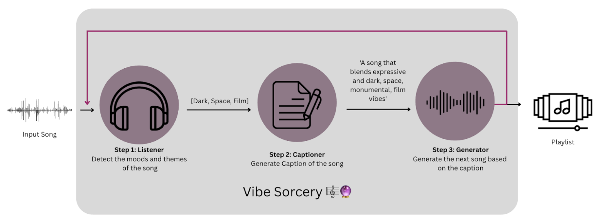

# Vibe Sorcery 🎼🔮  
**Summoning the perfect song for your mood, every time.**

*Vibe Sorcery* is a mood-based playlist generator that leverages generative music to create emotionally cohesive listening experiences. Conventional playlist generator systems treat songs as clusters, selecting the next track based on shared patterns of the entire set such as the same artist, similar tempos or harmonic structures. This static perspective assumes that all songs in the playlist should feel similar to one another, prioritizing uniformity over progression. In contrast, we propose a system based on an alternative perspective: modeling playlist generation as a Markov process, where each subsequent song depends only on the preceding one. In our system, both the genre and the mood of the current track shape the selection of the next song, with mood progression taking precedence and relying solely on the immediately preceding track rather than the entire playlist history.

The core hypothesis is that an effective playlist mirrors an emotional journey, where coherence arises not from static similarity but from dynamic progression. While each transition between songs is determined locally, the overall sequence can still trace a path through widely different emotional states. These changes occur gradually, allowing the playlist to move, for instance, from somber and subdued moods to uplifting and energetic ones.

The motivation behind Vibe Sorcerer stems from a lifelong passion for music. Listening has always been a way for me to clear my mind, process emotions, and stay present. I believe music is one of the most powerful tools for emotional awareness and expression. This project is a personal exploration of how technology can amplify the emotional power of music—and how generative systems can be used not just to create sound, but to shape feeling. In the future, this idea of playlist generation could support therapeutic practices by guiding listeners through carefully curated emotional states. Moreover, using generated songs helps ensure that the emotional response they evoke is not influenced by cultural or contextual associations tied to commercial music, allowing for a clearer and more controlled induction of specific emotional states.


# Example Outputs 💿

| Input Song                  | Link to Playlist               |
|-----------------------------|--------------------------------|
| Weird Fishes - Radiohead      | [Playlist Weird Fishes 🐡](https://drive.google.com/drive/folders/1PW4qn21WVpikNL7Fwp-uiQVjLlj428Xp?usp=drive_link)           |
| Psychosocial - Slipknot     | [Playlist Psychosocial 👽](https://drive.google.com/drive/folders/1QucwrYmalB8VHqLnpkzl1nIbloJtWeCl?usp=sharing)        |
| Atlas - Coldplay     | [Playlist Atlas 🗺️](https://drive.google.com/drive/folders/1WrOiCoHNEMs4E8pm3Ue0cB093Ne_rG8h?usp=drive_link)        |
| Inevitable - Shakira     | [Playlist Inevitable 🫀](https://drive.google.com/drive/folders/1H-rQQeNn2zjmvwRo-nCGh0tOO_6lv4TR?usp=sharing)        |
| Eclipse - João Gilberto     | [Playlist Eclipse 🌑](https://drive.google.com/drive/folders/1-CEAv7NSxBwkxxOHFPXTQXkshSoi3ch2?usp=sharing)             |

## Getting Started with *Vibe Sorcery*

### 1. Clone the repository
Begin by cloning the repository to your local machine:
```
git clone https://github.com/IsitaRex/Vibe-Sorcery.git
```
### 2. Install Dependencies
Navigate to the project directory and install the required dependencies:
```
pip install -r requirements.txt
```

### 3. Download Pre-trained Models
Download the necessary pre-trained models and save them in a folder named `Models`. Use the following commands:

 ```bash
mkdir -p Models && cd Models
 ```
Download the pre-trained models and save them inside a folder called 
  ```bash
# !wget https://essentia.upf.edu/models/music-style-classification/discogs-effnet/discogs-effnet-bs64-1.pb
# !wget https://essentia.upf.edu/models/classification-heads/mtg_jamendo_moodtheme/mtg_jamendo_moodtheme-discogs-effnet-1.pb
# !wget https://essentia.upf.edu/models/classification-heads/mtg_jamendo_genre/mtg_jamendo_genre-discogs-effnet-1.pb
# !wget https://essentia.upf.edu/models/classification-heads/deam/deam-audioset-vggish-2.pb
# !wget https://essentia.upf.edu/models/feature-extractors/vggish/audioset-vggish-3.pb
# !wget https://essentia.upf.edu/models/feature-extractors/musicnn/msd-musicnn-1.pb
# !wget https://essentia.upf.edu/models/classification-heads/deam/deam-audioset-musinn-2.pb

 ```

### 4. Create your Playlist

Create a folder called `playlist` (or any name you prefer) and upload a .wav song named `playlist_song_0.wav.` To generate a playlist containing 6 songs, each 47 seconds long, execute:

  ```bash
  python main.py -o playlist -n 6 -d 47.0
   ```

## How does the magic in Vibe Sorcery work?  🪄


Vibe Sorcery is implemented through a set of Python classes, each managing a specific step in the playlist generation process:
1. Choose a song
2. `class Listener`: Detect the song’s moods using MTG Listening Models
3. `class Captioner`: Generate a caption describing the song based on its moods
4. `class Generator`: Create a new song based on the caption
5. `class VibeSorcery`: Repeat the process to complete the playlist

### Listener 🎧
The Listener takes a `.wav` file as input, extracts audio embeddings, and uses a multi-label classifier to predict moods. Moods with activations above a threshold (`0.06`) are selected. If none meet the threshold, the top four moods are chosen. The output is a Python list of detected moods.

### Captioner ✍🏻
The Captioner takes the mood list and generates a descriptive caption using grammar templates and synonym dictionaries. Templates were pre-generated with ChatGPT to ensure structured outputs. For each mood, synonyms are randomly selected to add variety. Two disjoint mood subsets (primary and secondary) are incorporated into templates like:
```
"A {primary_moods} song with hints of {secondary_moods} undertones."
```
Using grammars instead of LLMs ensures consistency and control over the style of the generated text.

### Generator 🎶
 The generated caption is used as a prompt to Stable Audio Open 1.0 to synthesize a new 47-second track, ensuring mood coherence across the playlist.

### Vibe Sorcery (Pipeline)
 This class integrates all the 3 previous classes in an iterative process. The user creates a folder named after the playlist and adds an input song (playlist_song_0.wav). Then, simply instantiate and call:
  ```bash
  vibe_sorcery = VibeSorcery(output_dir='playlist')
  playlist_dict = vibe_sorcery.generate_playlist(input_song_path='playlist/playlist_song_0.wav', num_songs=6, duration=47.0)
  ```

## 📚 Citation  

If you use *Vibe Sorcery* in your research or projects, please cite our paper:  

Urrego-Gómez, I., Colton, S., & Roman, I. R. (2025). *Vibe Sorcery: Integrating Emotion Recognition with Generative Music for Playlist Curation*. 1st Workshop on Large Language Models for Music & Audio (LLM4MA). [OpenReview](https://openreview.net/forum?id=RArmM7K0zI)  

```bibtex
@inproceedings{
urrego-gomez2025vibe,
title={Vibe Sorcery: Integrating Emotion Recognition with Generative Music for Playlist Curation},
author={Isabel Urrego-G{\'o}mez and Simon Colton and Iran R Roman},
booktitle={1st Workshop on Large Language Models for Music {\&} Audio (LLM4MA)},
year={2025},
url={https://openreview.net/forum?id=RArmM7K0zI}
}

